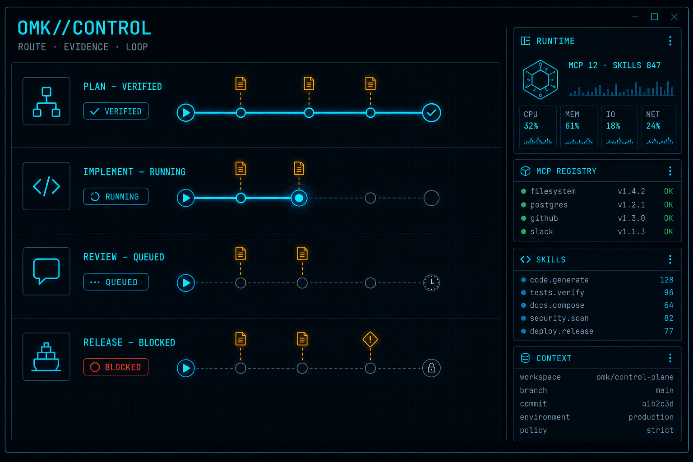

<p align="center">
  
</p>

<p align="center">
  
</p>

<h1 align="center">OMK</h1>

<p align="center">
  <strong>OMK//CONTROL — provider-neutral multi-agent control plane for coding workflows.</strong>
</p>

<p align="center">
  Models execute. OMK routes, verifies, measures, and controls.
</p>

<p align="center">
  <a href="https://discord.com/invite/3cU7Bz4UPx"></a>
  <a href="https://www.npmjs.com/package/open-multi-agent-kit"></a>
  <a href="https://github.com/dmae97/omk/releases/tag/v0.91.0"></a>
</p>

> New issues and PRs from new contributors are auto-closed by default. Maintainers review auto-closed issues daily. See [CONTRIBUTING.md](CONTRIBUTING.md).

---

## Installation

```bash
npm install -g open-multi-agent-kit --ignore-scripts
```

Then run it:

```bash
omk --version
omk
```

Or without a global install:

```bash
npx --ignore-scripts open-multi-agent-kit
```

Library packages:

```bash
npm install omk-agent-core   # Agent runtime with tool calling and state management
npm install omk-ai           # Unified multi-provider LLM API
npm install omk-tui          # Terminal UI library with differential rendering
```

---

# OMK Agent Harness Mono Repo

This is the home of the omk agent harness project including our self extensible coding agent.

* **[open-multi-agent-kit](packages/coding-agent)**: Interactive coding agent CLI
* **[omk-agent-core](packages/agent)**: Agent runtime with tool calling and state management
* **[omk-ai](packages/ai)**: Unified multi-provider LLM API (OpenAI, Anthropic, Google, …)

To learn more about omk:

* [Project demos from Mario](https://www.threads.com/@been_yg?hl=ko)
* [Browse all public Skills](SKILLS.md)
* [Read the documentation](https://omk.dev/docs/latest), but you can also ask the agent to explain itself

## OMK//CONTROL TUI

<p align="center">
  
</p>

The OMK//CONTROL startup surface is the default operator view. The header reads `omk v<package.version> · OMK//CONTROL`, using the installed workspace package version as its source of truth.

The default dark TUI theme uses the `omk-control-grid-dark` Night City palette and keeps the control sidebar focused on route, evidence, loop, MCP, runtime, skills, and context budget state.

## One control plane: deploy skills with OMK

OMK is not another model shell. It is the control plane around the models you already use: provider routing, scoped tools and MCP, evidence gates, parallel execution, and an operator-visible terminal surface.

**Official skill distribution uses OMK packages.** Build a package once, install it through `omk`, pin it, scope it to a project when needed, and enable or disable its resources from the same control plane. This README intentionally does not send users through a separate skills launcher.

```bash
# Global, pinned OMK package
omk install npm:open-multi-agent-kit@0.91.0

# Project-local, pinned Git package
omk install -l git:github.com/dmae97/open-multi-agent-kit@v0.91.0

# Inspect and control the installed resources
omk list
omk config
omk update --extensions
```

A skills-only package is an ordinary OMK package:

```json
{
  "name": "omk-workflows",
  "keywords": ["omk-package"],
  "omk": {
    "skills": ["./skills"]
  }
}
```

### From objective to verified delivery

| Need | OMK route | Output |
| --- | --- | --- |
| Shape a capability | `!omk plan a bounded goal` | Constraints, owned paths, and acceptance predicates |
| Run a bounded workflow | `!omk-loop <goal>` | Evidence-gated implementation, recovery, and a terminal status |
| Route marketing work | `!skill:omk-marketing <objective>` | One primary marketing skill plus at most one prerequisite support skill |
| Extend the harness | `omk install <pinned-package>` | Versioned extensions, skills, prompts, and themes under OMK control |

Use the minimum necessary skills per turn—usually one to three. A skill is loaded when it earns its place in the task, not because it happens to be installed.

### Why teams choose OMK

- **Control, not lock-in.** Keep providers interchangeable while retaining one execution, evidence, and operator model.
- **Evidence before completion.** A green-looking response is not a release signal; declared predicates and fresh verification are.
- **Parallelism with boundaries.** Independent work can run concurrently while owned paths, side effects, and evidence remain explicit.
- **Extensibility without a fork.** Ship skills, extensions, prompts, and themes as OMK packages instead of teaching every contributor a separate runtime.

The proof standard is operational: evaluate OMK against your own task completion, verification coverage, setup time, and recovery behavior. We do not claim an unmeasured benchmark win over another harness.

<!-- releases:start -->

## Release v0.91.0

### Added

- **System-wide resource metrics in the footer** — the footer CPU/MEM segment now reports whole-machine utilization (aggregate `os.cpus()` busy percentage and `totalmem - freemem`) instead of process-scoped usage. Wide terminals show `CPU 42% MEM 35% (18.0GB/50.5GB)`; thresholds are percentage-based (warning ≥70% CPU or ≥85% MEM, error ≥90%/95%). Process-scoped getters remain available on the sampler for diagnostics.
- **Aurora theme pair** — new built-in `omk-aurora-dark` and `omk-aurora-light` themes with WCAG-verified contrast (body text ≥14:1, muted ≥5.7:1, semantic colors ≥4.5:1), a full 51-token color map, and a stepped thinking-level color ramp. Aliases: `aurora`, `aurora-dark`, `aurora-light`.
- **AdaptOrch advisory bridge wiring** — opt-in, global-only `adaptorchBridge` settings block (`enabled`, `ttlMs`, `timeoutMs`, `maxConsultsPerSession`, `failureThreshold`). When enabled, the v4 auto thinking-level resolver consults the circuit-breaker-protected, TTL-cached advisory bridge and fuses the returned hint as a bounded ±2-step nudge; the resolver's own confidence escalation still applies on top. Default remains fully off, and a project-scope settings file can never enable it.

### Changed

- **`omk-adaptorch-wpl` promoted to stable** and added as a runtime dependency of `open-multi-agent-kit` (lockstep `0.91.0`). The Work Packet Loop state machine, outcome adjudicator, and verification-wall modules now ship with the CLI package.
- Repository hygiene: local-only research corpora and audit artifacts are no longer tracked in git (they remain on disk, with a local SHA-256 integrity manifest for the project-owned subset).

### Fixed

- Masked API-key-like values in newly submitted user chat before extensions, models, event streams, and session persistence.
- Restored `omk-adaptorch-wpl` handling in the coding-agent shrinkwrap generator so internal workspace packaging stays reproducible.

### Notes

- Published to npm as `open-multi-agent-kit@0.91.0` (lockstep with `omk-ai`, `omk-agent-core`, `omk-tui`, and `omk-adaptorch-wpl` at `0.91.0`).
- Verification boundary: `tsgo --noEmit` clean; adaptorch-wpl suite 73/73, coding-agent regression suite 784/784, theme suites green. Live-provider coverage remains outside this release.

Release notes live in [RELEASE_NOTES_v0.91.0.md](.github/RELEASE_NOTES_v0.91.0.md).

## Release v0.90.9

### Added

- Closed every emitted tool turn with one terminal result across normal, blocked, aborted, timed-out, failed, and resume paths; missing-result repair remains idempotent and duplicate/orphan results fail closed.
- Added a deterministic resource-claim DAG scheduler that preserves source-order artifacts, keeps unknown, `bash`, and unclaimed extension tools exclusive, and retains `waves-v1` as the compatibility rollback path.
- Added execution-bound evidence receipts that bind normalized local command outcomes, artifact/workspace fingerprints, redacted output digests, and replay-ledger state; the built-in CLI and `AgentSession` bash paths remain outside this optional evidence executor.
- Made compaction transactional behind closed tool turns, revision compare-and-swap, and stale-summary discard.
- Added typed termination, incomplete-run recovery, and `omk session doctor`, including dry-run repair for unambiguous recoverable state only.
- Added provider-origin-aware `omk provider doctor` diagnostics with sanitized Level 0–2 probes for native, custom OpenAI-compatible, and local-proxy endpoints.

### Notes

- Published to npm as `open-multi-agent-kit@0.90.9` (lockstep with `omk-ai`, `omk-agent-core`, and `omk-tui` at `0.90.9`); prebuilt binaries are attached to the GitHub release.
- Verification boundary: build/check and the keyless workspace suite passed; live-provider and other-OS coverage remain outside this release. Validate existing integrations against your workload.

Release notes live in [RELEASE_NOTES_v0.90.9.md](.github/RELEASE_NOTES_v0.90.9.md).

## Release v0.90.8

### New Features

- **GPT-5.6 MoA virtual model** — `openai-codex/gpt-5.6-moa` combines bounded concurrent Sol and Terra analysis into one Sol-synthesized response. See [provider setup](packages/coding-agent/docs/providers.md).
- **Path-safe parallel tool-batch waves** — independent tool calls run in ordered waves while conflicts and unknown operations remain sequential. See [the agent runtime](packages/agent/README.md).
- **Context-budget v2 controls** — enable the global budget with `contextBudget.enabled` and select an authenticated compaction model with `compaction.model`. See [settings](packages/coding-agent/docs/settings.md) and [compaction](packages/coding-agent/docs/compaction.md).
- **Evidence-gated Correctness Wall** — fixtureless live OA uses a bound MCP handler only and otherwise remains preview-only. See the [Correctness Wall example](packages/coding-agent/examples/extensions/correctness-wall/README.md).
- **Project-local computer use** — the Stagehand extension and `omk-computeruse` skill add bounded, approval-gated browser workflows. See [the extension](.omk/extensions/omk-computeruse-stagehand/README.md).

### Added

- Added the tool-free `openai-codex/gpt-5.6-moa` virtual model, which combines bounded, concurrent GPT-5.6 Sol and Terra analyses into one Sol-synthesized response for analysis and review tasks.
- Added `partitionToolBatchWaves` to run ordered, contiguous safe tool-call waves instead of serializing an entire batch when one call conflicts or is unknown.
- Added `compaction.model`, allowing auto-compaction and `/compact` to use an authenticated model such as `zai/glm-5.2` without changing the active session model.
- Added the project-local Stagehand computer-use extension and `omk-computeruse` skill for bounded browser observation, approval-gated actions, and redacted extraction.

### Changed

- Added global-only `contextBudget.enabled` to activate context-budget v2 for every OMK session; `OMK_CONTEXT_GOVERNOR=1`/`0` remain per-process on/off overrides. Each enabled `AgentSession` reuses an in-memory plan and representation cache without disk or cross-session sharing.

### Fixed

- Fixed the CLI help omitting the accepted `max` and `ultra` thinking levels, and fixed GPT-5.6 Codex `ultra` requests failing with an invalid-enum HTTP 400.
- Fixed loop write-scope validation to collapse `.`/`..` path segments, so traversal like `src/../package.json` can no longer slip past `allowedWriteScopes`, `deniedWriteScopes`, or changed-file checks.
- Fixed the context-budget v2 representation chooser to respect the remaining tier budget: it now falls back to a smaller representation (e.g. summary) instead of over-selecting full text and dropping the whole item at the tier ceiling.
- Hardened the guardrails evidence ledger: replay events now carry a `prevHash`/`eventHash` tamper-evident chain verified on load (edited, deleted, or reordered ledger lines fail closed), `TaskContractBuilder.fromJSON` validates the contract shape instead of blindly casting, `build()`/`getEvents()`/`getLedger()` return deep copies, and verification-report table cells escape pipes/newlines from untrusted claim or command text.
- Fixed the footer `PKG` counter and control-panel `ports:` label dropping accepted advisory/report-only package ports from every bucket (`PKG 12/16 R0 B0` for 16 accepted candidates); the intake summary now counts them via `acceptedAdvisory`, so all accepted ports read as connected (`PKG 16/16`).
- Fixed Correctness Wall edit/write hooks to use fixtureless live OA only with non-empty run IDs, explicit MCP transport, and a bound MCP handler; unbound handlers fall back to preview-only evaluation.

Release notes live in [RELEASE_NOTES_v0.90.8.md](.github/RELEASE_NOTES_v0.90.8.md).

<!-- releases:end -->

## Share your OSS coding agent sessions

If you use OMK or other coding agents for open source work, publish sanitized sessions from `.omk/agent/sessions`.

Public OSS session data helps improve coding agents with real-world tasks, tool use, failures, and fixes instead of toy benchmarks.

## All Packages

| Package | Description |
|---------|-------------|
| **[omk-ai](packages/ai)** | Unified multi-provider LLM API (OpenAI, Anthropic, Google, etc.) |
| **[omk-agent-core](packages/agent)** | Agent runtime with tool calling and state management |
| **[open-multi-agent-kit](packages/coding-agent)** | Interactive coding agent CLI |
| **[omk-tui](packages/tui)** | Terminal UI library with differential rendering |

For Slack/chat automation and workflow integrations, use OMK extensions and MCP servers.

## Adaptorch MCP integration

[AdaptOrch MCP](https://adaptorch.ai.kr) is a separate, proprietary reliability-kernel service (not part of
this monorepo) that OMK can route orchestration tasks through: topology-aware DAG routing, multi-model
synthesis, and consistency verification. It is versioned `0.1.0` — an MVP stage — with a public-ready free
Starter tier and paid Pro/Team tiers, and is backed by a published paper
([arXiv:2602.16873](https://arxiv.org/abs/2602.16873)).

The `adaptorch` and `adaptorch-prod` MCP servers plus the `adaptorch-route` and `adaptorch-synthesize` skills
ship in OMK's default `omk-core-verified` execution preset, so they are available from the first prompt of a
default session without extra setup. Actually invoking AdaptOrch (e.g. `adaptorch_run`) still requires an
`ADAPTORCH_CONTROL_PLANE_TOKEN` (a dev token is auto-set for a local control plane at `127.0.0.1:8000`) and
follows normal task-routing rules rather than firing on every message.

This is distinct from `packages/adaptorch-wpl` in this monorepo, the stable Work Packet
Loop package shipped as a runtime dependency of `open-multi-agent-kit` since v0.91.0 — see that package's own
README for details.

## Permissions & Containerization

OMK does not include a built-in permission system for restricting filesystem, process, network, or credential access. By default, it runs with the permissions of the user and process that launched it.

If you need stronger boundaries, containerize or sandbox OMK. See [packages/coding-agent/docs/containerization.md](packages/coding-agent/docs/containerization.md) for three patterns:

- **OpenShell**: run the whole `omk` process in a policy-controlled sandbox.
- **Gondolin extension**: keep `omk` and provider auth on the host while routing built-in tools and `!` commands into a local Linux micro-VM.
- **Plain Docker**: run the whole `omk` process in a local container for simple isolation.

## Contributing

See [CONTRIBUTING.md](CONTRIBUTING.md) for contribution guidelines and [development.md](packages/coding-agent/docs/development.md) for project setup.

## Development

```bash
npm install --ignore-scripts  # Install all dependencies without running lifecycle scripts
npm run build        # Build all packages
npm run check        # Lint, format, and type check
./test.sh            # Run tests (skips LLM-dependent tests without API keys)
./omk-test.sh        # Run OMK from sources (can be run from any directory)
```

## Supply-chain hardening

We treat npm dependency changes as reviewed code changes.

- Direct external dependencies are pinned to exact versions. Internal workspace packages remain version-ranged.
- `.npmrc` sets `save-exact=true` and `min-release-age=2` to avoid same-day dependency releases during npm resolution.
- `package-lock.json` is the dependency ground truth. Pre-commit blocks accidental lockfile commits unless `OMK_ALLOW_LOCKFILE_CHANGE=1` is set.
- `npm run check` verifies pinned direct deps, native TypeScript import compatibility, and the generated coding-agent shrinkwrap.
- The published CLI package includes `packages/coding-agent/npm-shrinkwrap.json`, generated from the root lockfile, to pin transitive deps for npm users.
- Release smoke tests use `npm run release:local` to build, pack, and create isolated npm and Bun installs outside the repo before tagging a release.
- Local release installs, documented npm installs, and `omk update --self` use `--ignore-scripts` where supported.
- CI installs with `npm ci --ignore-scripts`, and a scheduled GitHub workflow runs `npm audit --omit=dev` plus `npm audit signatures --omit=dev`.
- Shrinkwrap generation has an explicit allowlist for dependency lifecycle scripts; new lifecycle-script deps fail checks until reviewed.

## License

MIT
