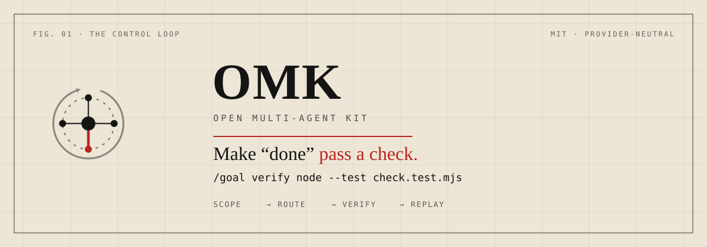

<p align="center">
  
</p>

<h1 align="center">OMK</h1>

<p align="center">
  <strong>Open Multi-Agent Kit</strong><br />
  Make “done” pass a check.
</p>

<p align="center">
  A terminal coding agent with model switching and explicit, test-backed goals.
</p>

<p align="center">
  <a href="https://www.npmjs.com/package/open-multi-agent-kit"></a>
  <a href="https://www.npmjs.com/package/open-multi-agent-kit"></a><br />
  <a href="https://github.com/dmae97/omk/releases/latest"></a><br />
  <a href="LICENSE"></a>
  
</p>

<p align="center">
  <a href="#quick-start">Quick start</a> ·
  <a href="#what-runs-by-default">Default or opt-in?</a> ·
  <a href="#evidence-and-limits">Evidence and limits</a><br />
  <a href="#faq">Choosing OMK</a> ·
  <a href="packages/coding-agent/docs/index.md">Documentation</a>
</p>

---

## Why OMK

An AI saying “done” is not an acceptance check. With `/goal verify`, you choose
the command that checks your goal. OMK runs it after each settled turn and
completes the goal only when it passes on the current workspace. A later edit
makes that evidence stale. The result is only as strong as the check you choose.

```text
/goal Fix the failing test without changing its assertions.
/goal verify node --test check.test.mjs
```

Use a test that exists in your project, or follow the
[small, reproducible goal demo](packages/coding-agent/docs/goal-demo.md).
This is an explicit workflow; ordinary prompts do not enable the gate.

Choose a model, work on your repository, then switch models with `/model` when
another one suits the next step. The conversation stays in the same session.
You can also stop and return later with `/resume` or `omk -c`.

OMK is a standalone CLI, not a plugin for Claude Code or OpenCode. It supports
[subscription providers, API keys, and local models](packages/coding-agent/docs/providers.md).
Start with one agent that reads files, edits code, and runs commands. Add
subagents or explicit verification workflows when you need them; neither is
required for your first task.

## Quick start

Requires Node.js 22.19 or newer. Start in the repository you want to work on:

```bash
npm install -g open-multi-agent-kit --ignore-scripts
omk --version
cd your-project
omk
```

Without a global install, run `npx --ignore-scripts open-multi-agent-kit` from
that directory.

1. Run `/login` to authenticate a supported subscription or API-key provider.
2. Run `/model` to choose an available model.
3. Try a read-only first task:

```text
Summarize this repository and identify the commands used to check it.
Read the project configuration to support your answer. Do not edit files.
```

After the reply, use `/model` to choose another configured model and ask it to
review the answer. You stay in the same session. This is manual model switching,
not parallel agents or an independent correctness check.

Ready to see a test-backed goal? Try the [goal demo](packages/coding-agent/docs/goal-demo.md),
then share your result or a reproducible failure in a
[GitHub issue](https://github.com/dmae97/omk/issues). If this workflow is useful,
[star OMK](https://github.com/dmae97/omk) to help other developers find it.

For a bug fix, name the failing behavior and ask for a regression test, the
smallest fix, and the check commands with their exit codes. Review the diff and
those results yourself; a request to run tests does not enable a verification
gate.

Built-in local bash requires `sandbox-exec` on macOS or `bwrap` plus
unprivileged user namespaces on Linux. It blocks network access and fails
closed if the backend is missing. See the [safety boundary](#verification-boundary)
and [full quickstart](packages/coding-agent/docs/quickstart.md) for setup.

## What runs by default

A fresh install starts one agent/tool loop after provider setup. It does not
turn each prompt into a multi-agent workflow or automatically certify its
answer.

| Capability | Fresh-install behavior | Where to start |
| --- | --- | --- |
| File editing, shell commands, saved sessions | Built in; tools run when called by the agent | [Usage](packages/coding-agent/docs/usage.md), [sessions](packages/coding-agent/docs/sessions.md) |
| Tool-call scheduling | `dag-v2` schedules resource conflicts within the agent loop; it does not launch a team | [Runtime algorithms](packages/coding-agent/docs/runtime-algorithms.md#tool-scheduling-and-settlement) |
| Subagents | Optional extension; load it and supply agent definitions | [Subagent setup and examples](packages/coding-agent/examples/extensions/subagent/README.md) |
| MCP servers, extra skills and extensions | Require configured servers or installed resources | [MCP](packages/coding-agent/docs/mcp.md), [skills](packages/coding-agent/docs/skills.md), [extensions](packages/coding-agent/docs/extensions.md) |
| Durable goals | Built in; `/goal <objective>` continues after each settled turn, up to 8 rounds. With `/goal verify <command>` the goal completes only when that check passes on the current workspace | [Acceptance checks](packages/coding-agent/docs/run-protocol.md#acceptance-checks) |
| Protocol verification and advisory judging | Explicit API/workflow opt-in; not a gate on ordinary prompts | [Run protocol](packages/coding-agent/docs/run-protocol.md) |
| Verified runs (`omk run`) | Opt-in CLI and SDK on Linux with `bwrap`; runs an approved command in an isolated copy, checks the result, and supports resume, cancel and cleanup | [Verified run](packages/coding-agent/docs/verified-run.md) |
| Context budgeting | Off by default | [Settings](packages/coding-agent/docs/settings.md#context-budget) |
| AdaptOrch integration | Optional and separate; no service calls by default | [OMK + AdaptOrch](#omk--adaptorch) |

The internal lane launcher and automatic command-sharding primitives are not
connected to the default CLI path. Installing their packages is not the same
as enabling an orchestration workflow.

## Evidence and limits

One comparative benchmark result is published: a single Terminal-Bench 2.1 run
against mini-swe-agent with the same model (below). Its success-rate difference
is not statistically significant. We have not established that OMK solves more
tasks than another harness, that multi-agent execution improves success, or how
much verification reduces false completion.

OMK targets state-of-the-art quality as a CLI coding-agent harness.
SOTA is not verified.

The evidence you can inspect today covers specific failure modes:

| Behavior covered | Regression evidence | Scope |
| --- | --- | --- |
| Missing test observations produce `inconclusive`; a required failing test produces `fail` | [Protocol tests](packages/protocol/test/protocol.test.ts) | Explicit protocol evaluation, without a waiver |
| Changed artifacts, wrong command bindings, or missing ledger evidence block acceptance | [Evidence binding tests](packages/coding-agent/test/evidence-gate-binding.test.ts) | Strict evidence gate and selected workspace scope |
| A relevant workspace mutation after verification makes the receipt stale | [Freshness tests](packages/coding-agent/test/evidence-freshness.test.ts) | Configured receipt and mutation tracking |
| A durable goal with an approved acceptance check completes only on a passing receipt, and an edit after the check makes that receipt stale | [Goal acceptance tests](packages/coding-agent/test/goal-controller-acceptance.test.ts), [live loop tests](packages/coding-agent/test/suite/goal-acceptance-loop.test.ts) | Approval held by the running OMK process; git work tree; static command lines |
| An effect that may still be live keeps its resource claims through expiry, cancellation and authority restart, until a supervisor confirms termination | [Coordination broker tests](packages/coding-agent/test/coordination-broker.test.ts) | In-process broker with canonical claim keys; no OS fencing |
| A publication is refused unless its read versions, parent revision and receipt binding all still match | [Publication tests](packages/coding-agent/test/coordination-integration.test.ts) | Single accepted snapshot pointer; no multi-file filesystem atomicity |
| Cancellation after dispatch is never reported as cancelled-before-dispatch; the outcome stays unknown until settled | [Operation lifecycle tests](packages/coding-agent/test/coordination-operation.test.ts) | Pure state machine; does not itself stop a remote effect |
| Zero trials is reported as absent evidence rather than zero risk, and a point estimate is not an error rate | [Risk bound tests](packages/coding-agent/test/metacognition-risk.test.ts) | Binomial model under a fixed policy and adequately independent samples |

These tests exercise the gates, not the rate at which they catch real bugs.
An ordinary prompt finishes when its tool loop and queued work settle;
`prompt_settled` is not a correctness verdict.

A useful comparison must hold the model, provider configuration, tasks, budget,
and tool permissions constant, and label default versus opt-in workflows.
Report task success, cost, latency, and false completion (reported complete but
failing the declared checks), with its denominator and per-task outcomes.
The [measurement protocol](packages/coding-agent/docs/metrics.md#controlled-comparison-contract)
defines the reproducibility and privacy requirements. `omk stats` shows local
turn costs and tool failures; it does not score task correctness.

If you evaluate OMK, share a sanitized report and reproduction steps in a
[GitHub issue](https://github.com/dmae97/omk/issues). Include failed and
interrupted runs, not just successful examples.

### Benchmark: Terminal-Bench 2.1

Terminal-Bench 2.1, 89 tasks × 3 trials per harness, xAI `grok-4.7` at
reasoning effort `xhigh` for both, run 2026-10-05 to 2026-10-06 KST. OMK was a
1.3.0 evaluation build (commit `78cc483`) that includes pull requests not yet
merged, not the published npm package. mini-swe-agent was version 2.4.6, run
through Harbor.

| Harness | Success rate (88 tasks × 3 trials) | Cost per trial (all 267 trials) | Median wall time per trial (all 267 trials) |
| --- | --- | --- | --- |
| OMK | 75.8% (200/264) | $0.581 | 482 s |
| mini-swe-agent 2.4.6 | 71.6% (189/264) | $0.759 | 376 s |

- The difference is +4.2 percentage points with a 95% confidence interval of
  [−1.9, +10.2] (task-level paired bootstrap). The interval includes zero, so
  this is **not** a statistically significant improvement.
- OMK cost about 23% less per trial but was slower: 482 s median per trial
  against 376 s.
- Audit corrections: trials that tried to read Terminal-Bench sources or
  answers score 0, which turned 4 mini-swe-agent passes and 1 OMK pass into
  failures.
  `prove-plus-comm` is excluded from both sides because our OMK adapter failed
  to start in that task's working directory. Two transient provider errors were
  retried; no trial was excluded.
- OMK failed all three `pytorch-model-recovery` trials because the CLI rejected
  an instruction starting with `- ` (fix in open pull request #84). Without that
  task the difference is +5.4 pp [0.0, +10.7].
- Not a leaderboard run: 3 trials instead of the official 5, our own network
  allowlist and apt cache proxy, and OMK alone had 150 s extra for a workspace
  snapshot used in rescoring.

Method, per-difficulty results, audit and reproduction notes:
[Terminal-Bench 2.1 report](packages/coding-agent/docs/benchmarks/r8-terminal-bench-2.1.md).

## OMK//CONTROL

The terminal UI shows the selected model, tools, and session status. Additional
signals depend on the integrations you configure.

<p align="center">
  
</p>

The header reads `omk v<package.version> · OMK//CONTROL`; the installed package
version is the source of truth.

## Control loop

<details>
<summary>How scope, routing, verification, and replay fit together</summary>

OMK's provider-neutral coding-agent CLI also exposes a multi-agent control
plane for explicitly configured workflows. The diagram describes that design,
not what every prompt automatically runs.

<p align="center">
  
</p>

The v0.98.3 SDK rejects incomplete first-party judge responses and exposes
deterministic ties; it is not an automatic TUI judge.

1. Scope the goal, paths, resources, and acceptance predicates. A selected
   orchestration workflow may also supply a DAG; an ordinary prompt remains
   one agent/tool loop.
2. Route work to models, agent skills, MCP tools, and extensions without
   changing the evidence contract.
3. Verify declared checks in explicit evidence workflows. Required failing
   checks block those workflows; advisory judging cannot replace them.
4. Preserve receipts and replay state for bounded session recovery; continue
   durable goals from explicit reducer state.

The animation changes once every 1.5 seconds and contains no flashing. The four
steps above are the complete text alternative.

</details>

## Verification boundary

`AgentSession` built-in local bash uses OS sandbox enforcement by default:
`sandbox-exec` on macOS and `bwrap` plus unprivileged user namespaces on Linux.
Local shell spawns restrict writes to the workspace and OS temporary directory,
disable network access, and fail closed with `sandbox.backend_missing` when an
enforcement backend is unavailable.

This is **not** read-confidentiality or whole-process containment. Other file
tools, extension and custom-tool code, injected or remote `BashOperations`, and
the OMK process keep the permissions of the process running them. Use
[containerization](packages/coding-agent/docs/containerization.md) when the
boundary must cover more than built-in local bash. Explicit evidence workflows
cannot treat missing required evidence as a verified result.

## Providers

<details>
<summary>Provider integrations and published packages</summary>

OMK keeps routing separate from control and evidence. Codex, Claude Code,
OpenCode Zen/Go, Kimi, GLM/ZAI, native xAI/Grok, NVIDIA NIM, and local providers
can participate through `omk-ai` while the run contract stays stable.

Native `xai` keeps subscription OAuth and `XAI_API_KEY` billing separate. See
[provider setup](packages/coding-agent/docs/providers.md),
[provider resilience](packages/coding-agent/docs/provider-resilience.md), and
[Grok integration](packages/coding-agent/docs/grok-harness.md).

## Published packages

| Package | Purpose |
| --- | --- |
| [`open-multi-agent-kit`](packages/coding-agent) | Interactive coding-agent CLI and control plane |
| [`omk-agent-core`](packages/agent) | Agent runtime, tool execution, and DAG scheduling |
| [`omk-ai`](packages/ai) | Unified multi-provider LLM API |
| [`omk-protocol`](packages/protocol) | Versioned run contracts and semantic reducers |
| [`omk-adaptorch-wpl`](packages/adaptorch-wpl) | Work Packet Loop runtime |
| [`omk-book-to-skill`](packages/book-to-skill) | Optional document-to-skill compiler |
| [`omk-tui`](packages/tui) | Differential-rendered terminal UI library |

```bash
npm install omk-agent-core
npm install omk-ai
npm install omk-protocol
omk install npm:omk-book-to-skill@0.98.3
npm install omk-tui
```

</details>

## Repository understanding

<details>
<summary>Optional indexes, retrieval settings, and trust limits</summary>

`v0.97.0` shipped the OpenWiki policy and workflow, but no versioned corpus or
integrity checker. The following integrity/output guards shipped in v0.98.0;
the generated corpus remains optional and is not bundled:

- **`openwiki/`** — absent. The previous untracked corpus was removed after the
  hardened gate proved it carried fabricated evidence: 8 frontmatter symbols
  that no declared source path defines (`AgentLoop`, `getModel`, `DeepWall`,
  `loadExtensions`, `createExtensionRuntime`, `main`), 45 references to `@omk/*`
  package names this repository does not publish, and a
  restatement of this README's `Scope -> Route -> Verify -> Replay` loop as a
  strict engine state machine, which is not what the source implements.
  CI regenerates the corpus; nothing is lost.
- **`scripts/check-openwiki.mjs`** — shipped integrity checker. An `interrupted` corpus
  now fails unless `openwiki/.manual-review.json` binds a review to the exact
  corpus digest, and every frontmatter symbol must bind to one of that page's
  own `source_paths` as a whole identifier.
- **`scripts/check-openwiki-output.mjs`** — output gate. The scheduled workflow
  may write, upload, and open a PR for `openwiki/` and nothing else, so a model
  reading this repository cannot reach `AGENTS.md`, `CLAUDE.md`, or the workflow
  that runs it. The gate runs once before the artifact leaves the read-only
  generating job and again before the PR, because the publishing job holds write
  permissions the first one does not.
- **`.understand-anything/`** — optional local structural graph used by Pi Lens;
  it is not published or injected into prompts by default. To reach a session,
  attach it through OMK's [MCP client](packages/coding-agent/docs/mcp.md) like
  any other server; there is no second, bespoke path for it.

Source and tests remain authoritative. Shipped guards do not turn a generated
index into authority: treat corpus pages as local advisory data and recheck source.

### Retrieval

A corpus no session can read is documentation of a plan, not a feature, so the
pages are now candidates for prompt budgeting. Enable `contextBudget.openwiki`
alongside `contextBudget.enabled`
([settings](packages/coding-agent/docs/settings.md#repository-wiki-retrieval))
and each page becomes a low-priority `evidence` item ranked against the turn's
query. Pages compete for leftover budget and can never displace instructions or
skills; most turns carry titles and declared symbols alone, and a page's text
arrives only when the query earns it.

Admission mirrors `scripts/check-openwiki.mjs` rather than restating it. A
complete corpus at the current `HEAD` offers page text; one whose `HEAD` has
moved offers titles only and is marked stale; an interrupted corpus is refused
unless a review binds to its exact digest. The default is off, and with the
setting off the prompt is byte-identical to one built without a corpus.

</details>

## OMK + AdaptOrch

<a href="https://adaptorch.com/?utm_source=github&utm_medium=readme&utm_campaign=omk">
  
</a>

OMK is this local, MIT-licensed coding agent. AdaptOrch is a separate
proprietary evidence service. Neither requires the other: installing OMK does
not create an AdaptOrch account or make calls to it by default.

For an optional integration, see the [WPL package and clients](packages/adaptorch-wpl/README.md)
and [MCP setup](packages/coding-agent/docs/mcp.md). The WPL package exposes
state, client, and adjudication primitives, not an automatic verification loop
for every CLI prompt.

AdaptOrch's reports carry `correctness_claim=false`; they are not semantic
correctness proofs or OMK harness benchmark results.
[Review AdaptOrch plans](https://adaptorch.com/?utm_source=github&utm_medium=readme&utm_campaign=omk#pricing)
· [Claim boundary](https://adaptorch.com/claim-boundary?utm_source=github&utm_medium=readme&utm_campaign=omk)

<sub>The AdaptOrch name and marks identify that separate proprietary product
and appear here with permission. They are excluded from this repository's MIT
grant — see [LICENSE](LICENSE).</sub>

## Prior art

<details>
<summary>Research references, not OMK benchmark results</summary>

The design decisions behind OMK's context, routing, memory, and orchestration
layers are grounded in published work rather than invented in isolation. Each
row below was retrieved and read directly; claims are at abstract level, which
is the evidence grade this table asserts and no more.

| Paper | Mechanism it establishes | OMK implementation or design reference |
| --- | --- | --- |
| [arXiv:2608.22752](https://arxiv.org/abs/2608.22752) — *The Compaction Cliff in Long-Running AI Agent Memory* | Uniform summarization erodes rules and episodic logs at the same rate; measured safety-rule retention falls to 53% after one compaction and 10% after five. Type-tagged deterministic operators fix it. | Type-aware compaction triage: rule-typed items survive N rounds byte-identical |
| [arXiv:2608.23023](https://arxiv.org/abs/2608.23023) — *Most of the LLM Routing Gap Is Task Type* | Most routing gain is reachable with a fixed task-type table; run-to-run flips must not be credited as wins. | Frozen task-class table plus the 2-run stability rule in the promotion gate |
| [arXiv:2506.16655](https://arxiv.org/abs/2506.16655) — *Arch-Router: Aligning LLM Routing with Human Preferences* | Indirection: a classifier emits a label, a policy table maps label to decision, so models change without retraining. | `classifyTaskV4` plus `TASK_CLASS_THINKING_LEVELS` |
| [arXiv:2605.09894](https://arxiv.org/abs/2605.09894) — *Deterministic vs. LLM-Controlled Orchestration* | Holding model, prompts, and tools constant and varying only execution control, deterministic orchestration matched accuracy, improved worst-case robustness, and cut tokens up to 3.5x. | Deterministic scheduler and planned lanes; execution control is never delegated to the model |
| [arXiv:2608.15565](https://arxiv.org/abs/2608.15565) — *Admission Without Answers* | Label-free admission on execution success alone admits substantial contamination; an accept/abstain/escalate decision is required. | Verified-memory admission design (spec 019), abstain is not stored |
| [arXiv:2608.23471](https://arxiv.org/abs/2608.23471) — *InjecMEM: Memory Injection Attack on LLM Agent Memory Systems* | Single-interaction memory injection is a reproduced attack frame against agent memory. | Retrieved memory is injected only as provenance-tagged data, never fused into instruction position |

Entries include implemented mechanisms and design proposals; check the
[runtime status guide](packages/coding-agent/docs/runtime-algorithms.md) for
availability. The wider survey, including approaches not adopted, is working
material that is not published with the repository.

</details>

## Documentation

- [Documentation index](packages/coding-agent/docs/index.md)
- [Usage](packages/coding-agent/docs/usage.md)
- [Turn metrics and harness evaluation](packages/coding-agent/docs/metrics.md)
- [Providers and models](packages/coding-agent/docs/providers.md)
- [Automation and SDK](packages/coding-agent/docs/sdk.md)
- [Run protocol](packages/coding-agent/docs/run-protocol.md)
- [Runtime algorithms and direction](packages/coding-agent/docs/runtime-algorithms.md)
- [Specification index](specs/README.md)
- [Sessions and recovery](packages/coding-agent/docs/sessions.md)
- [Security](packages/coding-agent/docs/security.md)
- [Containerization](packages/coding-agent/docs/containerization.md)
- [Public skill catalog](SKILLS.md)
- [Changelog](packages/coding-agent/CHANGELOG.md)
- [Release notes for v1.3.0](.github/RELEASE_NOTES_v1.3.0.md)

## Development

```bash
npm ci --ignore-scripts
npm run build
npm run check
npm test
npm run release:local
```

Direct dependencies are pinned, CI installs with `--ignore-scripts`, and the
published CLI includes a generated `npm-shrinkwrap.json`. Read
[CONTRIBUTING.md](CONTRIBUTING.md) and the
[development guide](packages/coding-agent/docs/development.md) before sending a
change.

## FAQ

### Why use OMK instead of Claude Code?

Use it for provider choice within one CLI session, or to build workflows
against its public runtime and evidence APIs. For a single-provider workflow,
your current agent may be sufficient. Try the [read-only task above](#quick-start)
before moving existing work.

### How is this different from OpenCode with plugins?

OMK is a separate runtime with its own CLI, sessions, tool scheduler, and SDK.
One reason to choose it is to build your own acceptance workflow: define
required test observations in the [run protocol](packages/coding-agent/docs/run-protocol.md),
then have your automation reject `fail` or `inconclusive` results. Receipt
integrity and freshness still need their own configured checks.

For adding a tool or prompt to an existing OpenCode setup, a plugin may be the
smaller change. OMK's protocol is opt-in, not proof of better performance.

### Does multi-agent mean better results or automatic verification?

Not automatically. Subagents require setup, and verification must be part of
the chosen workflow. Its result covers the declared checks, not all behavior. See
[what runs by default](#what-runs-by-default) and [evidence and limits](#evidence-and-limits).

## Recent releases

<details>
<summary>Release notes and historical corrections</summary>

> Historical correction: the immutable v0.97.0 notes below announced a
> versioned OpenWiki corpus, but that release still ignored `/openwiki/` and did
> not contain the corpus or checker. See the current repository-understanding
> section above for the shipped guards and optional-corpus boundary.

<!-- releases:start -->

## Release v1.3.0

### New Features

- **Evidence-gated durable goals**: `/goal verify <command>` approves an acceptance check that runs in the default bash sandbox after each settled turn. The goal completes only when the check passes on the current workspace, and the check's output never reaches the model. See [acceptance checks](packages/coding-agent/docs/run-protocol.md#acceptance-checks).
- **Resumable cancellation, remote cancel and cleanup for verified runs**: a cancelled `omk run` pauses instead of failing and resumes with `restart-writer`, `resume` or `retry-tasks`. `omk run cancel` stops a run from another shell, and `omk run gc` prunes derived workspaces while keeping the evidence. See [cancellation](packages/coding-agent/docs/verified-run.md#취소와-원격-취소) and [artifact GC](packages/coding-agent/docs/verified-run.md#artifact-gc).
- **MCP startup isolation**: an MCP server that exits during startup is marked `failed` with a classified error, and every other server still contributes its tools. See [failure behavior](packages/coding-agent/docs/mcp.md#failure-behavior).

### Breaking Changes

- Cancelling a live verified run (`SIGINT`, `SIGTERM` or the new `omk run cancel`) no longer ends it `failed`. The run stays `paused` with `failure: cancelled`, and its journal records a new `interrupted` event. Resume the phase that was cut off with `restart-writer`, `resume` or `retry-tasks`; a DAG attempt whose process was confirmed stopped is released instead of spent. A verification check cut off by the cancellation is no longer signed into the receipt as a failed check. OMK 1.2.4 and earlier cannot read a journal that contains `interrupted`, and a status consumer that treated cancellation as terminal must handle `paused`. See [cancellation](packages/coding-agent/docs/verified-run.md#취소와-원격-취소).

### Added

- Experimental POSIX local session control: explicitly enroll with `OMK_SESSION_CONTROL=1` or `session.startControl()`, then use `sdk session ... --live`. Exact session IDs and private per-enrollment endpoints are required; live failures never become transcript writes.
- Experimental workspace source-quote memory: explicit SDK admission, source-bound Observations, expiry/revocation and per-request freshness checks. Recall requires `OMK_VERIFIED_MEMORY=1` plus Context Budget V2 and uses transient tool-result data, not instruction text. No automatic extraction or quality-improvement claim.
- `/goal verify <command>` approves an acceptance check for the durable goal and runs it through receipt-bound local bash under the default bash sandbox. A passing check is attached as goal evidence. After each settled turn the check runs again: a pass completes the goal, and a failure starts the next round with the command and its exit code, never its output. `/goal complete` then requires a passing receipt from this session that still matches the workspace; a tracked edit, new file or HEAD move after the check makes it stale. Approvals stay in the OMK process, so approve the check again after a restart. See [acceptance checks](packages/coding-agent/docs/run-protocol.md#acceptance-checks).
- `nextDurableGoalTimestamp(goal)` is exported for SDK callers of `applyDurableGoalCommand()` and `DurableGoalStore.transition()`. It returns the wall clock, raised to no earlier than the goal's last update and later than the start of its generation, which is the time the reducer accepts after the clock steps back (seen on WSL2). See [durable goal lifecycle](packages/coding-agent/docs/run-protocol.md#durable-goal-lifecycle).
- `omk run cancel ID [--wait-ms N]` cancels a verified run owned by another process. It writes a request file that the owner checks every 250 ms and never signals a PID. `watchRunCancelRequest()` connects the same request to an SDK caller's `AbortSignal`, and `cancelVerifiedRun()` is the SDK form of the command.
- `omk run gc [--older-than DURATION] [--execute]` prunes the derived workspaces (`writer*`, `candidate*`, `tasks`) of verified runs that can no longer be recovered, holding each run's owner lease while it checks. It keeps journals, keys, manifests, blobs, receipts and attestations, never follows symlinks, and only reports without `--execute`. SDK: `collectVerifiedRuns()`.
- Before dispatching a prompt, `AgentSession` checks the complete request against the model window less the output reserve and safety margin (`computeHardPromptInputLimit()`). `estimateContextInputTokens()` counts the system prompt, the messages after `convertToLlm()` and the tool schemas, and takes the largest of the configured tokenizer count, the character heuristic and projected provider usage.
- `session.metacognition` exposes a content-free `state` snapshot and the latest bounded `lastDiagnostic`, observed at prompt preflight and settlement. It is observation-only: it never rewrites a prompt, authorizes a tool, changes termination or grants completion.
- MCP SDK options: `McpServerConfig.inheritEnv: false` keeps the parent environment out of a stdio server, `maxPendingWriteBytes` (default 16 MiB) bounds bytes queued on the server's stdin, and `await manager.closeAndWait()` joins physical transport close. `manager.status()` marks a server whose close is pending with `retiring: true`. `inheritEnv` is not read from `mcp.json` yet.

### Changed

- Skill relevance ranking on the live prompt-to-skill path matches Korean inflections and Latin word stems through containment and bigram-Dice token matching. The exported `planSkills()` prunes its exact search and adds dominance and eviction-refill passes to its greedy search.
- Context Budget V2 orders ranking, redundancy, exchange, selected output and cache and plan hashes by UTF-16 code-unit ID order. The selection cache policy is `sel-4-codeunit`, so entries cached under the earlier policy are not reused; the public optimizer identifier is unchanged.
- `omk run` reports an error outside the verified-run contract as `verified-run: operation_failed (<kind> <code>)`, for example `(Error ENOTDIR)`, instead of a bare `operation_failed`. The message itself stays out of the output because it can carry absolute paths or contract text.

### Fixed

- On macOS, replay-ledger process identity probes force the C locale for BSD `ps`, so Korean and other non-English parent locales no longer make a live process appear unavailable. The acceptance-check regression fixtures use canonical physical temporary repository paths on macOS, preserving workspace-mismatch rejection across `/var` and `/private/var` aliases.
- Updated dependency security pins: `brace-expansion` 5.0.12 and `undici` 8.10.2, plus `undici` 6.28.1 for the optional Gondolin example. That example still depends on `node-forge` 1.4.0, whose RSA signature-verification advisory has no patched npm release as of 2026-10-04; the repository production audit continues to report it.
- The durable goal loop continues again. Through 1.2.4 the goal controller advanced the round at every attempt's `agent_end` and sent the next turn while that run still owned the session; the session rejected it with `Agent is already processing`, so the round was spent and the goal never continued. The controller now acts once a turn settles, when no automatic retry follows it, and queues the next round as a follow-up. An attempt that is about to be retried no longer uses up a round.
- Durable goal transitions no longer fail with `goal timestamps must be monotonic` or `goal generation timestamp must advance` when the wall clock steps back, as WSL2 does when its hypervisor resyncs time. The controller dates each transition no earlier than the journal's last timestamp.
- A verified run no longer stops with `operation_failed` when the wall clock steps back under load. The authority store's default clock is the wall time at open plus monotonic elapsed time; a clock injected by the caller that moves backward is still refused.
- A scripted-agent writer cancelled between model requests is recorded as cancelled, not as `writer_incomplete`, and `omk run status` suggests recovery only for runs that are running or paused.
- An MCP server that exits during startup is marked `failed` with a classified public error while every other server still contributes its tools. A malformed tool result rejects with `mcp.invalid_tool_result` instead of counting as success. Request and handshake timeouts accept only safe integers from 0 through 2,147,483,647 ms, and `0` refuses to send. `manager.status()` omits free-form server-reported versions.
- MCP transport retirement waits for the physical process or stdio close, not the kill request: a failed startup keeps its queue slot and a same-server reconnect waits for the old transport to close. A subagent dispatch holds a process-local lease on its workload pool, so a concurrent dispatch receives `ownership.dispatch_active`. Numeric environment values with trailing characters are rejected instead of parsed as a prefix, and prompt-size estimation projects each tool's name, description and parameters instead of serializing the tool object.
- A workload permit waiter's expiry is checked when a permit is granted, not only by its timer.
- Session shutdown observes each independent close request and every join before it releases resources, and does not return a resource whose release it could not confirm. The same MCP transport is no longer retired twice, and a previous owner's waiters are not released by the new owner. A registered command that replaces the session ends only its control frame; exhausting the run budget still fails the run.
- `RpcClient` keeps only the last 8,192 characters of the current child's stderr and clears them on `start()`. `waitForIdle()` and `collectEvents()` reject when the child fails, exits or is stopped, and one waiter unsubscribing no longer makes another miss `agent_end`. `stop()` rejects pending requests at once, returns without the one-second delay when the child already exited, and rejects with `RpcTerminationUncertainError` while keeping ownership when termination cannot be confirmed. `prompt()` propagates a server rejection, so `promptAndWait()` no longer waits for its 60-second timeout.
- `SessionManager.getBranch()` no longer shifts the path array for every ancestor (2,096,128 element moves at depth 2,048, now none). The run journal builds its frozen record copy only when `records` is read, and the memory-only journal store no longer replays every earlier record on each append (8,256 hashes for 128 appends, now 128). An `AgentSession` listener that unsubscribes while an event is dispatched no longer makes the next listener miss it.
- The bundled `omk-ai` and `omk-agent-core` fixes apply: `complete()` and `completeSimple()` no longer queue every stream event until they return, a Cursor request that reaches its deadline is closed instead of left running, provider retries reject invalid options and stop early on an aborted signal, and taking queued messages one at a time no longer copies the rest of the queue.
- The subagent example's graph and adaptive paths keep partial output apart from completion evidence, keep sibling-task and tool-call rows, and bound previews, update frequency and parser lifetime. A bounded run's result keeps the final attempt's `attemptId`, process settlement and stream receipts instead of the first attempt's, and the README install list includes `managed-process-tree.ts`, `subagent-stream.ts` and `graph-result.ts`, without which the extension did not load.
- A session whose context grew past the prompt input ceiling no longer stops with `Context limit reached` until a manual `/compact`. Threshold compaction fired at 90% of the context window, but prompt admission rejects above the window minus the model's output reserve and a 10% safety margin, which is lower for 1,862 of 1,876 catalogued models: `opencode-go/deepseek-v4.1-flash` rejected at 516,000 input tokens while compaction waited for 900,000. Compaction now triggers at `compaction.maxUsageRatio` of that ceiling, less pending tool-result and image reserves (464,400 for that model). A prompt still over the ceiling gets one automatic compaction and a re-check before it is rejected; that rejection reports the committed compaction as a side effect.
- A compacted session no longer stays at `Context limit reached` while `/compact` answers `Already compacted`. Admission kept counting the provider usage reported before the compaction: one `anthropic/claude-opus-5-5` session was rejected at 808,236 estimated tokens against a 772,000-token ceiling after its history had shrunk to about 13,500. Usage recorded at or before the latest compaction no longer counts, and a repeated `/compact` re-cuts the tail the previous compaction kept, using the 4,096-token emergency keep budget. The visible reasoning of turns a later user message closed, which providers drop, no longer counts toward the next turn's estimate.
- A model whose input window cannot hold every MCP tool schema no longer rejects every prompt. `devin/swe-2`, configured with a 262,000-token window, rejected even a 45-token first message because its tool schemas (328 MCP tools plus the built-ins) were estimated at 237,218 tokens, over its 219,416-token input ceiling. Requests to such a model now withhold whole MCP servers, largest schema first, until a fully compacted session fits under the compaction trigger. Withholding stops only once a recount of the remaining schemas fits. The selection is fitted again for every turn, and within a turn whenever the model, the system prompt, a tool schema or the tool-to-server mapping changes, so an MCP server that reconnects with larger schemas under the same tool names is withheld from the next request. The active tool set is unchanged, a warning names the withheld servers, and they return on a model with room. A prompt rejected because the system prompt and tool schemas alone overflow is reported as `configuration.invalid`, and input still too large after automatic compaction as `compaction.failed`, instead of `provider.context_overflow`.
- Manual compaction waits for an aborted prompt's budget wrapper to finish cleanup before starting summaries. Preflight-local compaction shares its current budget, and self-waiting active-agent calls refuse. Aborted, empty or nonterminal model output is no longer accepted as a durable summary.
- `AgentSession.close()` and runtime disposal retain the session owner lease until registered work and native MCP transport closure settle. Legacy busy disposal starts the same close rather than releasing ownership early.
- An abort during prompt preflight closes that request's admission before it can dispatch a model. In-flight MCP reattachment joins the retiring manager before publishing replacements.
- The Context Budget V2 caches are bounded by size and no longer share objects with their callers. Each in-memory store kept up to 256 entries (2,048 in the disk provider) of any size, and kept the objects it was given, so a caller that changed an entry after writing or reading it also changed the cached copy. Stores now have byte budgets (8 MiB of representations, 2 MiB of plans and 256 KiB of negative entries in the session provider; 16 MiB, 4 MiB and 512 KiB resident in the disk provider) and keep immutable JSON copies; a value that is not plain JSON data is not cached. A disk snapshot over its 32 MiB cap with negative entries alone failed every later flush; it now shrinks until it fits. Cache limits that are not safe integers throw `RangeError`.
- Automatic retries no longer retry at once when a backoff grows past the longest delay a Node timer holds (2,147,483,647 ms). The agent-turn retry and the compaction and branch-summary retries doubled `retry.baseDelayMs` without limit, and Node fires a longer timer after 1 ms, so a base of 3,000,000,000 ms retried after about 1 ms. Delays now stop at that limit, and the exported `computeRetryDelayMs` returns at most 2,147,483,647; below it, every result for a base that converts to a non-negative number is unchanged. A base that converts to NaN or a negative number uses the 2 s default, `+Infinity` takes the limit, and a `retry.maxRetries` that converts to NaN now means no retries; before, neither retry ran out.
- Fireworks, Together and OpenCode Go no longer default to a Kimi K2.6 id that the 2026-09-30 catalog refresh dropped; model resolution fell back to the provider's first catalog entry. Fireworks and Together default to Kimi K3 (`accounts/fireworks/models/kimi-k3`, `moonshotai/Kimi-K3`), which keeps their transport contract. OpenCode Go defaults to `deepseek-v4.1-flash`: OMK has not verified the request contract of its Kimi K3 or K2.7 Code, and models.dev marks its K2.6 deprecated.

Release notes live in [RELEASE_NOTES_v1.3.0.md](.github/RELEASE_NOTES_v1.3.0.md).

## Release v1.2.4

### New Features

- `omk provider adopt [<id>] [--from <source>] [--dry-run] [--json] [--status]` copies an existing Codex CLI or Claude Code CLI login into OMK's credential store, so a subscription does not have to be signed in twice. Sources are read-only, `--from` narrows to the provider's own mapping, and no token material reaches output.

### Fixed

- A credential store that cannot be read is no longer treated as "no credential": request auth refuses to substitute stale environment or models.json keys, `agent-session` reports the store error instead of advising `/login`, and a transient lock contention is retried instead of deciding authentication for the whole process lifetime.
- `omk provider doctor` accepts engine-registered API types (`devin-agent`, `cursor-agent`) instead of rejecting them as unsupported.
- Compaction commits survive append-only extension state written while the summary is generated; only provably inert `custom` tails are rebased, and a `length` stop that produced no summary text fails instead of committing an empty summary. The compaction source-entry bound is 65,536.
- `addOAuthAccount` merges imported accounts inside the storage lock (no lost update across concurrent sessions) and never overwrites a usable stored refresh token with an absent one.
- A post-dispatch rejection that provably never spawned (a deadline crossing between the dispatch journal and the supervisor call) now journals the exit and settles the run instead of leaving the execution id open forever.

Release notes live in [RELEASE_NOTES_v1.2.4.md](.github/RELEASE_NOTES_v1.2.4.md).

## Release v1.2.3

### Fixed

- Verified-run suite hardening: tests use a 15s cleanup budget so slow namespace teardown on ubuntu-22.04 runners drains before settling, matching the witness contract without weakening fail-closed outcomes (no product-code change).

Release notes live in [RELEASE_NOTES_v1.2.3.md](.github/RELEASE_NOTES_v1.2.3.md).

<!-- releases:end -->

</details>

## Acknowledgments

OMK builds on [pi](https://github.com/badlogic/pi-mono) — Mario Zechner's
MIT-licensed coding-agent harness — and began from the
[oh-my-pi](https://github.com/can1357/oh-my-pi) fork. The vendored tree was
removed in this release line; OMK `0.9x` is OMK-native (see
[`specs/constitution.md`](specs/constitution.md)), and the design debt to both
projects stands. Thank you.

## License

MIT
