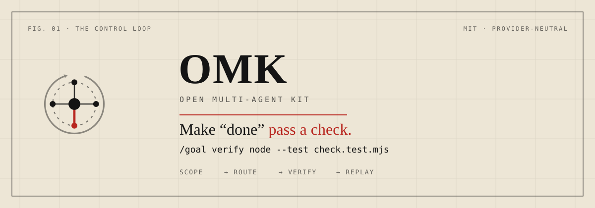
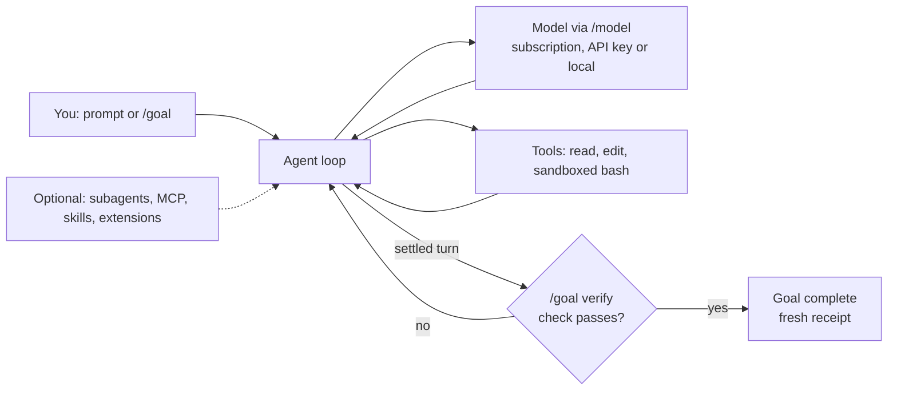
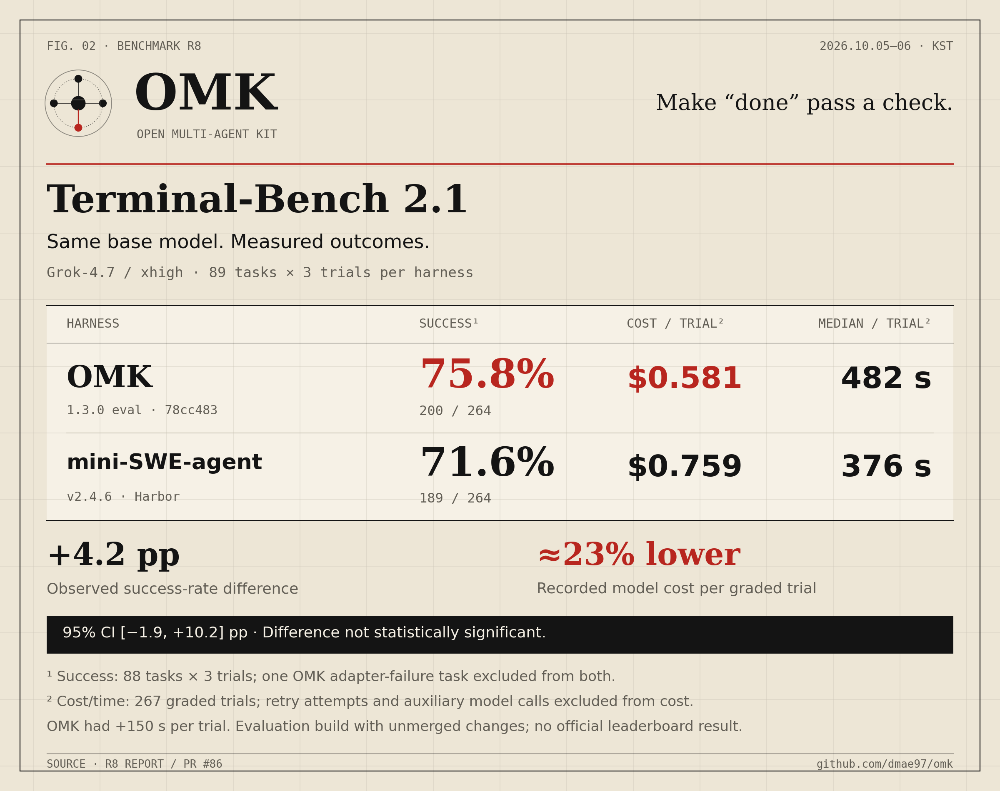

<p align="center">
  
</p>

<h1 align="center">OMK</h1>

<p align="center">
  <strong>Open Multi-Agent Kit</strong><br />
  Make “done” pass a check.
</p>

<p align="center">
  An open-source multi-agent coding CLI for your terminal: switch models in one
  session and finish a goal only when your test passes.
</p>

<p align="center">
  <a href="https://www.npmjs.com/package/open-multi-agent-kit"></a>
  <a href="https://www.npmjs.com/package/open-multi-agent-kit"></a><br />
  <a href="https://github.com/dmae97/omk/releases/latest"></a>
  <a href="https://github.com/dmae97/omk/actions/workflows/ci.yml"></a>
  <a href="https://github.com/dmae97/omk/stargazers"></a><br />
  <a href="LICENSE"></a>
  
</p>

<p align="center">
  <a href="#quick-start">Quick start</a> ·
  <a href="#what-runs-by-default">Default or opt-in?</a> ·
  <a href="#evidence-and-limits">Evidence and limits</a><br />
  <a href="#faq">Choosing OMK</a> ·
  <a href="packages/coding-agent/docs/index.md">Documentation</a>
</p>

---

OMK is a lightweight, MIT-licensed AI coding agent for your terminal, written in
TypeScript. Switch models in one session, add subagents when you need them, and
mark a goal done only when your own check passes. It is a standalone CLI, so it
can serve as an open-source alternative to a single-provider agent such as
Claude Code.

Requires Node.js 22.19 or newer:

```bash
npm install -g open-multi-agent-kit --ignore-scripts
cd your-project
omk
```

The first run opens `/login` (subscription, API key, or local model). To try it
without a global install: `npx --ignore-scripts open-multi-agent-kit`.
Details in [Quick start](#quick-start).

<!-- TODO: terminal demo GIF goes here (install, `omk`, a `/goal verify` run passing).
     Record a real session; do not use a mock-up. -->

## Why OMK

An AI saying “done” is not an acceptance check. With `/goal verify`, you choose
the command that checks your goal. OMK runs it after each settled turn and
completes the goal only when it passes on the current workspace. A later edit
makes that evidence stale. The result is only as strong as the check you choose.

```text
/goal Fix the failing test without changing its assertions.
/goal verify node --test check.test.mjs
```

Use a test that exists in your project, or follow the
[small, reproducible goal demo](packages/coding-agent/docs/goal-demo.md).
This is an explicit workflow; ordinary prompts do not enable the gate.

Choose a model, work on your repository, then switch models with `/model` when
another one suits the next step. The conversation stays in the same session.
You can also stop and return later with `/resume` or `omk -c`.

OMK is a standalone CLI, not a plugin for Claude Code or OpenCode. It supports
[subscription providers, API keys, and local models](packages/coding-agent/docs/providers.md).
Start with one agent that reads files, edits code, and runs commands. Add
subagents or explicit verification workflows when you need them; neither is
required for your first task.

### At a glance

- **Done means a passing check.** `/goal verify <command>` completes a goal only when your check passes on the current workspace.
- **One session, many models.** Switch with `/model` mid-conversation; resume later with `/resume` or `omk -c`.
- **Sandboxed by default.** Built-in bash runs under `sandbox-exec` or `bwrap`, without network, and fails closed.
- **Opt-in power.** Subagents, MCP servers, skills and extensions load only when you configure them.
- **Honest evidence.** Claims below link to the docs that back them, and the limits are stated next to them.


```mermaid
flowchart LR
  U[You: prompt or /goal] --> L[Agent loop]
  L --> M[Model via /model<br/>subscription, API key or local]
  M --> L
  L --> T[Tools: read, edit, sandboxed bash]
  T --> L
  L -->|settled turn| V{/goal verify<br/>check passes?}
  V -- no --> L
  V -- yes --> D[Goal complete<br/>fresh receipt]
  X[Optional: subagents, MCP, skills, extensions] -.-> L
```

## Quick start

Install from npm (Node.js 22.19 or newer), then start in your repository:

```bash
npm install -g open-multi-agent-kit --ignore-scripts
cd your-project
omk
```

Or run `npx --ignore-scripts open-multi-agent-kit` without a global install.

Or install the standalone binary, which needs no Node.js (macOS, Linux):

```bash
curl -fsSL https://github.com/dmae97/omk/releases/latest/download/install.sh | sh
```

The script checks the download against the release's `SHA256SUMS` and installs
to `~/.omk/bin`; add that folder to your `PATH` as it tells you. Windows builds
are attached to each [release](https://github.com/dmae97/omk/releases/latest).

1. On a first run OMK opens `/login` for you: sign in with a subscription or an
   API key. An existing Claude Code or Codex CLI login can be reused with
   `omk provider adopt`.
2. Run `/model` to choose another available model at any time.
3. Try a read-only first task:

```text
Summarize this repository and identify the commands used to check it.
Read the project configuration to support your answer. Do not edit files.
```

After the reply, use `/model` to choose another configured model and ask it to
review the answer. You stay in the same session. This is manual model switching,
not parallel agents or an independent correctness check.

Ready to see a test-backed goal? Try the [goal demo](packages/coding-agent/docs/goal-demo.md),
then share your result or a reproducible failure in a
[GitHub issue](https://github.com/dmae97/omk/issues). If this workflow is useful,
[star OMK](https://github.com/dmae97/omk) to help other developers find it.

For a bug fix, name the failing behavior and ask for a regression test, the
smallest fix, and the check commands with their exit codes. Review the diff and
those results yourself; a request to run tests does not enable a verification
gate.

Built-in local bash requires `sandbox-exec` on macOS or `bwrap` plus
unprivileged user namespaces on Linux (`sudo apt install bubblewrap` on Debian
and Ubuntu). It blocks network access and fails closed if the backend is missing.
`omk doctor` checks the runtime, credentials, the model a first session would
pick, and the sandbox, and prints the fix for this machine. See
[Bash sandbox setup](packages/coding-agent/docs/sandbox-setup.md), the
[safety boundary](#verification-boundary) and the
[full quickstart](packages/coding-agent/docs/quickstart.md).

## What runs by default

A fresh install starts one agent/tool loop after provider setup. It does not
turn each prompt into a multi-agent workflow or automatically certify its
answer.

| Capability | Fresh-install behavior | Where to start |
| --- | --- | --- |
| File editing, shell commands, saved sessions | Built in; tools run when called by the agent | [Usage](packages/coding-agent/docs/usage.md), [sessions](packages/coding-agent/docs/sessions.md) |
| Tool-call scheduling | `dag-v2` schedules resource conflicts within the agent loop; it does not launch a team | [Runtime algorithms](packages/coding-agent/docs/runtime-algorithms.md#tool-scheduling-and-settlement) |
| Subagents | Optional extension; load it and supply agent definitions | [Subagent setup and examples](packages/coding-agent/examples/extensions/subagent/README.md) |
| MCP servers, extra skills and extensions | Require configured servers or installed resources | [MCP](packages/coding-agent/docs/mcp.md), [skills](packages/coding-agent/docs/skills.md), [extensions](packages/coding-agent/docs/extensions.md) |
| Durable goals | Built in; `/goal <objective>` continues after each settled turn, up to 8 rounds. With `/goal verify <command>` the goal completes only when that check passes on the current workspace | [Acceptance checks](packages/coding-agent/docs/run-protocol.md#acceptance-checks) |
| Protocol verification and advisory judging | Explicit API/workflow opt-in; not a gate on ordinary prompts | [Run protocol](packages/coding-agent/docs/run-protocol.md) |
| Verified runs (`omk run`) | Opt-in CLI and SDK on Linux with `bwrap`; runs an approved command in an isolated copy, checks the result, and supports resume, cancel and cleanup | [Verified run](packages/coding-agent/docs/verified-run.md) |
| Context budgeting | Off by default | [Settings](packages/coding-agent/docs/settings.md#context-budget) |
| AdaptOrch integration | Optional and separate; no service calls by default | [OMK + AdaptOrch](#omk--adaptorch) |

The internal lane launcher and automatic command-sharding primitives are not
connected to the default CLI path. Installing their packages is not the same
as enabling an orchestration workflow.

## Evidence and limits

One dated comparison is available below: OMK and mini-SWE-agent on
Terminal-Bench 2.1 with the same base model. The observed success-rate
difference is not statistically significant, and the time budgets differed.
It does not establish overall harness superiority, multi-agent gains, or how
much verification reduces false completion.

OMK targets state-of-the-art quality as a CLI coding-agent harness.
SOTA is not verified.

The evidence you can inspect today covers specific failure modes:

| Behavior covered | Regression evidence | Scope |
| --- | --- | --- |
| Missing test observations produce `inconclusive`; a required failing test produces `fail` | [Protocol tests](packages/protocol/test/protocol.test.ts) | Explicit protocol evaluation, without a waiver |
| Changed artifacts, wrong command bindings, or missing ledger evidence block acceptance | [Evidence binding tests](packages/coding-agent/test/evidence-gate-binding.test.ts) | Strict evidence gate and selected workspace scope |
| A relevant workspace mutation after verification makes the receipt stale | [Freshness tests](packages/coding-agent/test/evidence-freshness.test.ts) | Configured receipt and mutation tracking |
| A durable goal with an approved acceptance check completes only on a passing receipt, and an edit after the check makes that receipt stale | [Goal acceptance tests](packages/coding-agent/test/goal-controller-acceptance.test.ts), [live loop tests](packages/coding-agent/test/suite/goal-acceptance-loop.test.ts) | Approval held by the running OMK process; git work tree; static command lines |
| An effect that may still be live keeps its resource claims through expiry, cancellation and authority restart, until a supervisor confirms termination | [Coordination broker tests](packages/coding-agent/test/coordination-broker.test.ts) | In-process broker with canonical claim keys; no OS fencing |
| A publication is refused unless its read versions, parent revision and receipt binding all still match | [Publication tests](packages/coding-agent/test/coordination-integration.test.ts) | Single accepted snapshot pointer; no multi-file filesystem atomicity |
| Cancellation after dispatch is never reported as cancelled-before-dispatch; the outcome stays unknown until settled | [Operation lifecycle tests](packages/coding-agent/test/coordination-operation.test.ts) | Pure state machine; does not itself stop a remote effect |
| Zero trials is reported as absent evidence rather than zero risk, and a point estimate is not an error rate | [Risk bound tests](packages/coding-agent/test/metacognition-risk.test.ts) | Binomial model under a fixed policy and adequately independent samples |

These tests exercise the gates, not the rate at which they catch real bugs.
An ordinary prompt finishes when its tool loop and queued work settle;
`prompt_settled` is not a correctness verdict.

A useful comparison must hold the model, provider configuration, tasks, budget,
and tool permissions constant, and label default versus opt-in workflows.
Report task success, cost, latency, and false completion (reported complete but
failing the declared checks), with its denominator and per-task outcomes.
The [measurement protocol](packages/coding-agent/docs/metrics.md#controlled-comparison-contract)
defines the reproducibility and privacy requirements. `omk stats` shows local
turn costs and tool failures; it does not score task correctness.

If you evaluate OMK, share a sanitized report and reproduction steps in a
[GitHub issue](https://github.com/dmae97/omk/issues). Include failed and
interrupted runs, not just successful examples.

### Terminal-Bench 2.1 · R8

<p align="center">
  
</p>

**75.8% observed success · approximately 23% lower recorded model cost per
graded trial.** OMK took longer: 482 s median, compared with 376 s for
mini-SWE-agent. Both used xAI `grok-4.7` at reasoning effort `xhigh` in a
2026-10-05–06 KST run of 89 tasks, with 3 trials per task per harness.

The +4.2 percentage-point success difference is **not statistically significant**
(95% task-level paired-bootstrap CI: −1.9 to +10.2 pp). OMK alone had **150 s
extra per trial** for snapshots, so the time budgets were unequal. This result
covers the **1.3.0 evaluation build `78cc483`**, including unmerged changes,
rather than the published npm package. It is not an official leaderboard result.

<details>
<summary>Benchmark data and evaluation limits</summary>

| Harness | Success rate (88 tasks × 3 trials) | Cost per trial (all 267 trials) | Median wall time per trial (all 267 trials) |
| --- | --- | --- | --- |
| OMK | 75.8% (200/264) | $0.581 | 482 s |
| mini-swe-agent 2.4.6 | 71.6% (189/264) | $0.759 | 376 s |

- The difference is +4.2 percentage points with a 95% confidence interval of
  [−1.9, +10.2] (task-level paired bootstrap). The interval includes zero, so
  this is **not** a statistically significant improvement.
- OMK cost about 23% less per trial but was slower: 482 s median per trial
  against 376 s.
- Audit corrections: trials that tried to read Terminal-Bench sources or
  answers score 0, which turned 4 mini-swe-agent passes and 1 OMK pass into
  failures.
  `prove-plus-comm` is excluded from both sides because our OMK adapter failed
  to start in that task's working directory. Two transient provider errors were
  retried; no trial was excluded.
- OMK failed all three `pytorch-model-recovery` trials because the CLI rejected
  an instruction starting with a dash and a space (fixed in #84). Without that
  task the difference is +5.4 pp [0.0, +10.7].
- Not a leaderboard run: 3 trials instead of the official 5, our own network
  allowlist and apt cache proxy, and OMK alone had 150 s extra for a workspace
  snapshot used in rescoring.

- Costs count only the graded attempt, excluding prior failed retry attempts and
  42 auxiliary model calls made by code inside one mini-SWE-agent task. They are
  not total experiment spend.

Method, per-difficulty results, audit and reproduction notes:
[Terminal-Bench 2.1 report](packages/coding-agent/docs/benchmarks/r8-terminal-bench-2.1.md).

</details>

[Editable figure](readmeasset/omk-terminal-bench-r8.svg) · [Original report review](https://github.com/dmae97/omk/pull/86)

## OMK//CONTROL

The terminal UI shows the selected model, tools, and session status. Additional
signals depend on the integrations you configure.

<p align="center">
  
</p>

The header reads `omk v<package.version> · OMK//CONTROL`; the installed package
version is the source of truth.

## Control loop

<details>
<summary>How scope, routing, verification, and replay fit together</summary>

OMK's provider-neutral coding-agent CLI also exposes a multi-agent control
plane for explicitly configured workflows. The diagram describes that design,
not what every prompt automatically runs.

<p align="center">
  
</p>

The v0.98.3 SDK rejects incomplete first-party judge responses and exposes
deterministic ties; it is not an automatic TUI judge.

1. Scope the goal, paths, resources, and acceptance predicates. A selected
   orchestration workflow may also supply a DAG; an ordinary prompt remains
   one agent/tool loop.
2. Route work to models, agent skills, MCP tools, and extensions without
   changing the evidence contract.
3. Verify declared checks in explicit evidence workflows. Required failing
   checks block those workflows; advisory judging cannot replace them.
4. Preserve receipts and replay state for bounded session recovery; continue
   durable goals from explicit reducer state.

The animation changes once every 1.5 seconds and contains no flashing. The four
steps above are the complete text alternative.

</details>

## Verification boundary

`AgentSession` built-in local bash uses OS sandbox enforcement by default:
`sandbox-exec` on macOS and `bwrap` plus unprivileged user namespaces on Linux.
Local shell spawns restrict writes to the workspace and OS temporary directory,
disable network access, and fail closed with `sandbox.backend_missing` when an
enforcement backend is unavailable.

This is **not** read-confidentiality or whole-process containment. Other file
tools, extension and custom-tool code, injected or remote `BashOperations`, and
the OMK process keep the permissions of the process running them. Use
[containerization](packages/coding-agent/docs/containerization.md) when the
boundary must cover more than built-in local bash. Explicit evidence workflows
cannot treat missing required evidence as a verified result.

## Providers

<details>
<summary>Provider integrations and published packages</summary>

OMK keeps routing separate from control and evidence. Codex, Claude Code,
OpenCode Zen/Go, Kimi, GLM/ZAI, native xAI/Grok, NVIDIA NIM, and local providers
can participate through `omk-ai` while the run contract stays stable.

Native `xai` keeps subscription OAuth and `XAI_API_KEY` billing separate. See
[provider setup](packages/coding-agent/docs/providers.md),
[provider resilience](packages/coding-agent/docs/provider-resilience.md), and
[Grok integration](packages/coding-agent/docs/grok-harness.md).

## Published packages

| Package | Purpose |
| --- | --- |
| [`open-multi-agent-kit`](packages/coding-agent) | Interactive coding-agent CLI and control plane |
| [`omk-agent-core`](packages/agent) | Agent runtime, tool execution, and DAG scheduling |
| [`omk-ai`](packages/ai) | Unified multi-provider LLM API |
| [`omk-protocol`](packages/protocol) | Versioned run contracts and semantic reducers |
| [`omk-adaptorch-wpl`](packages/adaptorch-wpl) | Work Packet Loop runtime |
| [`omk-book-to-skill`](packages/book-to-skill) | Optional document-to-skill compiler |
| [`omk-tui`](packages/tui) | Differential-rendered terminal UI library |

```bash
npm install omk-agent-core
npm install omk-ai
npm install omk-protocol
omk install npm:omk-book-to-skill@0.98.3
npm install omk-tui
```

</details>

## Repository understanding

<details>
<summary>Optional indexes, retrieval settings, and trust limits</summary>

`v0.97.0` shipped the OpenWiki policy and workflow, but no versioned corpus or
integrity checker. The following integrity/output guards shipped in v0.98.0;
the generated corpus remains optional and is not bundled:

- **`openwiki/`** — absent. The previous untracked corpus was removed after the
  hardened gate proved it carried fabricated evidence: 8 frontmatter symbols
  that no declared source path defines (`AgentLoop`, `getModel`, `DeepWall`,
  `loadExtensions`, `createExtensionRuntime`, `main`), 45 references to `@omk/*`
  package names this repository does not publish, and a
  restatement of this README's `Scope -> Route -> Verify -> Replay` loop as a
  strict engine state machine, which is not what the source implements.
  CI regenerates the corpus; nothing is lost.
- **`scripts/check-openwiki.mjs`** — shipped integrity checker. An `interrupted` corpus
  now fails unless `openwiki/.manual-review.json` binds a review to the exact
  corpus digest, and every frontmatter symbol must bind to one of that page's
  own `source_paths` as a whole identifier.
- **`scripts/check-openwiki-output.mjs`** — output gate. The scheduled workflow
  may write, upload, and open a PR for `openwiki/` and nothing else, so a model
  reading this repository cannot reach `AGENTS.md`, `CLAUDE.md`, or the workflow
  that runs it. The gate runs once before the artifact leaves the read-only
  generating job and again before the PR, because the publishing job holds write
  permissions the first one does not.
- **`.understand-anything/`** — optional local structural graph used by Pi Lens;
  it is not published or injected into prompts by default. To reach a session,
  attach it through OMK's [MCP client](packages/coding-agent/docs/mcp.md) like
  any other server; there is no second, bespoke path for it.

Source and tests remain authoritative. Shipped guards do not turn a generated
index into authority: treat corpus pages as local advisory data and recheck source.

### Retrieval

A corpus no session can read is documentation of a plan, not a feature, so the
pages are now candidates for prompt budgeting. Enable `contextBudget.openwiki`
alongside `contextBudget.enabled`
([settings](packages/coding-agent/docs/settings.md#repository-wiki-retrieval))
and each page becomes a low-priority `evidence` item ranked against the turn's
query. Pages compete for leftover budget and can never displace instructions or
skills; most turns carry titles and declared symbols alone, and a page's text
arrives only when the query earns it.

Admission mirrors `scripts/check-openwiki.mjs` rather than restating it. A
complete corpus at the current `HEAD` offers page text; one whose `HEAD` has
moved offers titles only and is marked stale; an interrupted corpus is refused
unless a review binds to its exact digest. The default is off, and with the
setting off the prompt is byte-identical to one built without a corpus.

</details>

## Prior art

<details>
<summary>Research references, not OMK benchmark results</summary>

The design decisions behind OMK's context, routing, memory, and orchestration
layers are grounded in published work rather than invented in isolation. Each
row below was retrieved and read directly; claims are at abstract level, which
is the evidence grade this table asserts and no more.

| Paper | Mechanism it establishes | OMK implementation or design reference |
| --- | --- | --- |
| [arXiv:2608.22752](https://arxiv.org/abs/2608.22752) — *The Compaction Cliff in Long-Running AI Agent Memory* | Uniform summarization erodes rules and episodic logs at the same rate; measured safety-rule retention falls to 53% after one compaction and 10% after five. Type-tagged deterministic operators fix it. | Type-aware compaction triage: rule-typed items survive N rounds byte-identical |
| [arXiv:2608.23023](https://arxiv.org/abs/2608.23023) — *Most of the LLM Routing Gap Is Task Type* | Most routing gain is reachable with a fixed task-type table; run-to-run flips must not be credited as wins. | Frozen task-class table plus the 2-run stability rule in the promotion gate |
| [arXiv:2506.16655](https://arxiv.org/abs/2506.16655) — *Arch-Router: Aligning LLM Routing with Human Preferences* | Indirection: a classifier emits a label, a policy table maps label to decision, so models change without retraining. | `classifyTaskV4` plus `TASK_CLASS_THINKING_LEVELS` |
| [arXiv:2605.09894](https://arxiv.org/abs/2605.09894) — *Deterministic vs. LLM-Controlled Orchestration* | Holding model, prompts, and tools constant and varying only execution control, deterministic orchestration matched accuracy, improved worst-case robustness, and cut tokens up to 3.5x. | Deterministic scheduler and planned lanes; execution control is never delegated to the model |
| [arXiv:2608.15565](https://arxiv.org/abs/2608.15565) — *Admission Without Answers* | Label-free admission on execution success alone admits substantial contamination; an accept/abstain/escalate decision is required. | Verified-memory admission design (spec 019), abstain is not stored |
| [arXiv:2608.23471](https://arxiv.org/abs/2608.23471) — *InjecMEM: Memory Injection Attack on LLM Agent Memory Systems* | Single-interaction memory injection is a reproduced attack frame against agent memory. | Retrieved memory is injected only as provenance-tagged data, never fused into instruction position |

Entries include implemented mechanisms and design proposals; check the
[runtime status guide](packages/coding-agent/docs/runtime-algorithms.md) for
availability. The wider survey, including approaches not adopted, is working
material that is not published with the repository.

</details>

## Documentation

- [Documentation index](packages/coding-agent/docs/index.md)
- [Usage](packages/coding-agent/docs/usage.md)
- [Turn metrics and harness evaluation](packages/coding-agent/docs/metrics.md)
- [Providers and models](packages/coding-agent/docs/providers.md)
- [Automation and SDK](packages/coding-agent/docs/sdk.md)
- [Run protocol](packages/coding-agent/docs/run-protocol.md)
- [Runtime algorithms and direction](packages/coding-agent/docs/runtime-algorithms.md)
- [Specification index](specs/README.md)
- [Sessions and recovery](packages/coding-agent/docs/sessions.md)
- [Security](packages/coding-agent/docs/security.md)
- [Containerization](packages/coding-agent/docs/containerization.md)
- [Public skill catalog](SKILLS.md)
- [Changelog](packages/coding-agent/CHANGELOG.md)
- [Release notes for v1.5.9](.github/RELEASE_NOTES_v1.5.9.md)
- Latest public release: [GitHub Releases](https://github.com/dmae97/omk/releases/latest). The source-version notes linked above can describe a candidate until its tag workflow completes.

## Development

```bash
npm ci --ignore-scripts
npm run build
npm run check
npm test
npm run release:local
```

Direct dependencies are pinned, CI installs with `--ignore-scripts`, and the
published CLI includes a generated `npm-shrinkwrap.json`. Read
[CONTRIBUTING.md](CONTRIBUTING.md) and the
[development guide](packages/coding-agent/docs/development.md) before sending a
change.

## FAQ

### What is OMK?

OMK (Open Multi-Agent Kit) is an open-source coding agent CLI for the terminal.
It reads files, edits code, and runs commands in your repository. You can switch
models inside one session, add subagents when a task needs them, and use
`/goal verify` so a goal only counts as done when your chosen check passes. It
is MIT-licensed and written in TypeScript.

### How do I install OMK?

With Node.js 22.19 or newer, run
`npm install -g open-multi-agent-kit --ignore-scripts`, then `omk` in your
project. Without Node.js, use the standalone installer on macOS or Linux:
`curl -fsSL https://github.com/dmae97/omk/releases/latest/download/install.sh | sh`.
See [Quick start](#quick-start).

### Why use OMK instead of Claude Code?

Use it for provider choice within one CLI session, or to build workflows
against its public runtime and evidence APIs. For a single-provider workflow,
your current agent may be sufficient. Try the [read-only task above](#quick-start)
before moving existing work.

### How is this different from OpenCode with plugins?

OMK is a separate runtime with its own CLI, sessions, tool scheduler, and SDK.
One reason to choose it is to build your own acceptance workflow: define
required test observations in the [run protocol](packages/coding-agent/docs/run-protocol.md),
then have your automation reject `fail` or `inconclusive` results. Receipt
integrity and freshness still need their own configured checks.

For adding a tool or prompt to an existing OpenCode setup, a plugin may be the
smaller change. OMK's protocol is opt-in, not proof of better performance.

### Does multi-agent mean better results or automatic verification?

Not automatically. Subagents require setup, and verification must be part of
the chosen workflow. Its result covers the declared checks, not all behavior. See
[what runs by default](#what-runs-by-default) and [evidence and limits](#evidence-and-limits).

## Recent releases

<details>
<summary>Release notes and historical corrections</summary>

> Historical correction: the immutable v0.97.0 notes below announced a
> versioned OpenWiki corpus, but that release still ignored `/openwiki/` and did
> not contain the corpus or checker. See the current repository-understanding
> section above for the shipped guards and optional-corpus boundary.

<!-- releases:start -->

## Release v1.5.9

### Added

- A default-on `deepseek_harness` built-in for native DeepSeek and recognized DeepSeek model IDs on gateways. It adds scoped execution guidance and projects oversized successful tool results to Unicode-safe head/tail excerpts at 80% context pressure, preserving original session history. `OMK_DEEPSEEK_HARNESS=0` independently disables it. No upstream runtime, credentials, session-log uploads, or protocol changes are introduced. See [DeepSeek harness](packages/coding-agent/docs/deepseek-harness.md).
- Project context documents. `omk init --project` creates missing `PRD.md`, `ARCHITECTURE.md`, `DESIGN.md`, `RULES.md`, `TASKS.md` and `PROGRESS.md` without overwriting files, and the project-directory walk loads each once as context. A bare `omk` launch in an otherwise empty Git repository root creates them too; `OMK_PROJECT_CONTEXT_BOOTSTRAP=0` disables that bootstrap. See [User context setup](packages/coding-agent/docs/context-files.md).
- Acceptance diagnostics behind `OMK_GOAL_DIAGNOSTICS` (flag, default off, spec 094). After a failed `/goal` acceptance check, the repair follow-up carries a bounded excerpt of the check output anchored at the first error line, falling back to head/tail (#170).

### Changed

- Seventeen `OMK_*` harness flags are now on by default: `OMK_EDIT_DIAGNOSTICS`, `OMK_EXEC_TRUNCATE_MIDDLE`, `OMK_JSON_SESSION_INFO`, `OMK_GOAL_AUTONOMY`, `OMK_SKILL_ADMISSION`, `OMK_SKILL_AUTO_LOAD`, `OMK_EVIDENCE_LIFECYCLE`, `OMK_ADAPTIVE_EFFORT`, `OMK_DOMAIN_ROUTING`, `OMK_GOAL_OUTPUT_RECALL`, `OMK_LANE_READY_QUEUE`, `OMK_LANE_FAILURE_SCOPE`, `OMK_RTK_OUTPUT`, `OMK_SESSION_CONTROL`, `OMK_VERIFIED_MEMORY`, `OMK_RESPONSE_REASONING_CAP` and `OMK_PREFIX_BOUNDARY`. Set any of them to `0`, `false` or `off` to restore the 1.5.8 behavior; with all of them off the G0 session hash is unchanged. `OMK_EVIDENCE_LIFECYCLE` now deletes only verified goal-recall files (`observe` deletes nothing), subagent workers keep `OMK_SKILL_AUTO_LOAD` and `OMK_ADAPTIVE_EFFORT` off, and an unset `OMK_SESSION_CONTROL` never fails startup. There is no on/off benchmark for these defaults yet (#279, #281).
- Evidence receipts store commands verbatim. Command credential redaction and its credential preflight are removed; existing v3 receipts with `commandRedaction` and `commandBinding` remain readable. Keep secrets out of command lines and pass them through the environment or credential storage (#223).
- The GitHub Copilot default model is now `gpt-6.1-sol`. Copilot retired `gpt-5.4`, which left Copilot without an automatic default during first-run onboarding.

### Fixed

- A durable goal whose approved acceptance check passed no longer stays active on a loaded host. The goal workspace binding now allows each git call 10 seconds instead of the 1.5 second per-bash-call bound, which `git status` could exceed and which then refused completion as an unavailable workspace scope. A git that hangs past the longer bound still fails closed; the bash tool scope keeps its 1.5 second bound.
- Repeated local skill searches reuse unchanged document term frequencies instead of tokenizing the entire catalog again. Changed bodies are retokenized, input bounds are revalidated, and scores, exclusions and ranking order remain query-specific.
- Local safe-context-window rejections during tool turns now enter bounded overflow compaction recovery instead of being classified as invalid provider responses. Auto-compaction opt-out and the hard input ceiling remain unchanged.
- A per-call bash `timeout` now also bounds the outer tool timer, so a requested timeout longer than the fixed 300 second limit is no longer cut short. Extension tools and session wrappers receive the same bound.
- Lock ownership no longer depends on the wall clock alone. The durable goal journal lock uses a 30 second stale window and a lost lock fails the write instead of crashing the process; the sync `auth.json` lock uses the same 30 second window as OAuth refresh, so a live refresh lock is no longer taken over; the trust store lock is reclaimed by owner pid and released only by its owner; and `omk session doctor` repair takes the session owner lease and refuses a live session with `session_in_use`.
- Goal evidence is pinned to its generation and a complete workspace scope, stale autocomplete acceptance is rejected, and next-suggestion cost ceilings, stream identity and request lifetimes are aligned.
- The status sidebar reads the current session's shared usage reader after `/new` or resume instead of the first session's.
- `omk run cancel` reads the run journal in reader mode, so an owner appending at the same time no longer makes it fail with `integrity`; persistent concurrent change reports `concurrent_change`.
- Durations, throttles, in-memory caches and deadlines now use a monotonic clock, so a wall-clock step (seen on WSL2) no longer makes them fire early, late or never. This covers the double Ctrl+C and Esc windows, the working timer, the bash output throttle, the subscription usage, diagnostics and workspace scope caches, edit diagnostic budgets, OAuth device-code polling and the TUI input drain. `npm run check` now rejects new wall-clock durations and proper-lockfile locks without an explicit stale window.

### Security

- Goal-recall evidence deletion refuses to run when `.omk/goals/recall` or one of its parents is a symlink.
- `npm audit --omit=dev` is clean again. `undici` is updated to 8.12.3 (EventSource memory, SRI token and content-encoding advisories), and a root override moves `zod` to 4.6.7 for every SDK and the sandbox example (oversized constrained collection advisory; no fixed 3.x release exists).
- The optional Gondolin example now uses Gondolin 0.14.0 with `undici` 6.29.1. Gondolin no longer depends on `node-forge`, so the temporary CVE-2026-85393 runtime guard is removed; a regression suite replays the malformed signatures against Gondolin's real cached-leaf verification. The example now requires Node.js 22.19.0 or later. Replace previously copied example directories. See [Gondolin signature security](packages/coding-agent/docs/gondolin-security.md).

Release notes live in [RELEASE_NOTES_v1.5.9.md](.github/RELEASE_NOTES_v1.5.9.md).

## Release v1.5.8

### Added

- Goal autonomy behind `OMK_GOAL_AUTONOMY=1` (flag, default off). `/goal budget <usd|-> [<deadline ISO>|-]` sets a user-only cost and deadline budget that includes subagent lane cost; the goal stops with `budget-limit`, `deadline`, `outcome-unknown` or `scope-changed`, steering pauses it, and only `/goal resume` restarts it. Stop reasons are custom entries; the `omk.goal.v1` schema is unchanged (#266, #268).
- Strong-only skill auto-load behind `OMK_SKILL_AUTO_LOAD` (flag, default off), with an observe-only `skill-autoload.jsonl` log (#262).
- Evidence recall delete-after-use behind `OMK_EVIDENCE_LIFECYCLE=delete` (flag, default off; `observe` only records) (#263).

With all new flags off, behavior is the same as 1.5.7.

### Fixed

- Evidence recall delete recovery can no longer fail `session_start` (#264).
- `session_info` JSON test no longer flakes (#265).

### Changed

- Research count scripts for spec 117 and 119 on synthetic fixtures (#267), NaN/Infinity tolerance (#269), header comment fix (#271).
- Spec 118 D3 measurement addendum, design only (#272).
- `AGENTS.md` lists the goal autonomy flag.

Release notes live in [RELEASE_NOTES_v1.5.8.md](.github/RELEASE_NOTES_v1.5.8.md).

## Release v1.5.7

### Added

- Structured diagnostics after `edit` and `write` behind `OMK_EDIT_DIAGNOSTICS` (flag, default off). Diagnostics are skipped when remote `operations` are passed (#250).
- Head plus tail bash output behind `OMK_EXEC_TRUNCATE_MIDDLE` (flag, default off) (#246).
- A `session_info` line in JSON output behind `OMK_JSON_SESSION_INFO` (flag, default off) (#244).

With all three flags off, behavior is the same as 1.5.6.

### Fixed

- Bash output keeps the full 50KB tail when one long line spans several chunks (#238).

### Changed

- Bench tooling: an ATIF trajectory exporter in `scripts/bench/atif-export.mjs` (#239), which also maps seq 2+ session-info lines (#251).
- Design specs added, not implemented: 113 head+tail bash output (#245), 114 indent-insensitive edit matching (#249).
- `AGENTS.md` records the autonomous development mode and the patch-release order (#241, #247).
- Pi inventory tests cover `.mts`, `.cts`, `.tsx` and `.mjs` discovery (#236).

Release notes live in [RELEASE_NOTES_v1.5.7.md](.github/RELEASE_NOTES_v1.5.7.md).

<!-- releases:end -->

</details>

## Contributing

Issues and pull requests are welcome. Read [CONTRIBUTING.md](CONTRIBUTING.md)
first, run `npm run check` and `npm test` before opening a pull request, and
report security issues as described in [SECURITY.md](SECURITY.md).

## Star OMK

If a check-backed “done” is useful to you, a
[star on GitHub](https://github.com/dmae97/omk/stargazers) helps other
developers find OMK.

<p align="center">
  <a href="https://star-history.com/#dmae97/omk&Date">
    
  </a>
</p>

## Acknowledgments

OMK builds on [pi](https://github.com/badlogic/pi-mono) — Mario Zechner's
MIT-licensed coding-agent harness — and began from the
[oh-my-pi](https://github.com/can1357/oh-my-pi) fork. The vendored tree was
removed in this release line; OMK `0.9x` is OMK-native (see
[`specs/constitution.md`](specs/constitution.md)), and the design debt to both
projects stands. Thank you.

## OMK + AdaptOrch

AdaptOrch is a separate, optional product and is not called by default. See
[OMK + AdaptOrch](packages/coding-agent/docs/omk-adaptorch.md) for the optional integration and
[TRADEMARKS.md](TRADEMARKS.md) for the name and marks.

## License

MIT
