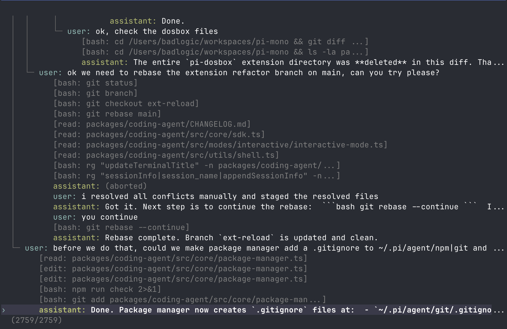

# Sessions

OMK saves conversations as sessions so you can continue work, branch from earlier turns, and revisit previous paths.

## Session Storage

Sessions auto-save to `~/.omk/agent/sessions/`, organized by working directory. Each session is a JSONL file with a tree structure.

```bash
omk -c                  # Continue most recent session
omk -r                  # Browse and select from past sessions
omk --no-session        # Ephemeral mode; do not save
omk --name "my task"    # Set session display name at startup
omk --session <path|id> # Use a specific session file or partial session ID
omk --fork <path|id>    # Fork a session file or partial session ID into a new session
```

Use `/session` in interactive mode to see the current session file, session ID, message count, tokens, and cost.

Stored sessions can also be inspected or appended from scripts:

```bash
omk sdk session status [id] [--json]
omk sdk session tail [id] [--limit 20]
omk sdk session inspect [id]
omk sdk session send <id> "message"
```

`send` requires an exact session ID and appends only when the session has no active owner; it does not connect to a running process or execute the message. See [SDK](sdk.md#inspect-persisted-sessions-from-the-cli) for full flags and exit codes.

For the JSONL file format and SessionManager API, see [Session Format](session-format.md).

## Retries and Termination Events

Each provider attempt writes its own `run_started`/`run_finished` journal pair and emits `session_termination`. A retryable termination is attempt-level when `auto_retry_start` follows it; consumers should not treat that event alone as the end of the outer `prompt()` call.

If a retry or failover succeeds, the later attempt emits `completed` and becomes `session.lastTermination`. If retry budget is exhausted, the last provider failure remains final. Quota, billing-cycle exhaustion, and provider-capacity waits (`at capacity`, Anthropic `overloaded_error`) are classified as `provider.rate_limit` and can switch through the configured provider-resilience chain before retrying. A Codex ChatGPT-account unsupported-model 400 or Anthropic `claude_code_version_too_old` is `configuration.invalid`: `/new session` will not grant access; switch with `/model`. See [Provider Resilience](provider-resilience.md).

## Session Commands

| Command | Description |
|---------|-------------|
| `/resume` | Browse and select previous sessions |
| `/new` | Start a new session |
| `/name <name>` | Set the current session display name |
| `/session` | Show session info |
| `/goal [objective]` | Show or set the durable goal; `checkpoint <json>` records Goal/Core/Verified/Open/Next continuity |
| `/tree` | Navigate the current session tree |
| `/fork` | Create a new session from a previous user message |
| `/clone` | Duplicate the current active branch into a new session |
| `/compact [prompt]` | Summarize older context; see [Compaction](compaction.md) |
| `/export [file]` | Export session to HTML |
| `/share` | Upload as private GitHub gist with shareable HTML link |

`/goal` state lives under the working directory, not in one session file. Seam checkpoints are digest-correlated revisions in the same goal journal; session entries contain only their goal ID, revision, and digest. The unkeyed digest is not workspace authentication, so checkpoint prose loaded on resume is not promoted to user authority. See [Run Protocol](run-protocol.md#durable-goal-lifecycle).

## Resuming and Deleting Sessions

`/resume` opens an interactive session picker for the current project. `omk -r` opens the same picker at startup.

In the picker you can:

- search by typing
- toggle path display with Ctrl+P
- toggle sort mode with Ctrl+S
- filter to named sessions with Ctrl+N
- rename with Ctrl+R
- delete with Ctrl+D, then confirm

When available, omk uses the `trash` CLI for deletion instead of permanently removing files.

## Naming Sessions

Use `/name <name>` to set a human-readable session name:

```text
/name Refactor auth module
```

Set the name at startup with `--name` or `-n`:

```bash
omk --name "Refactor auth module"
omk --name "CI audit" -p "Review this build failure"
```

Named sessions are easier to find in `/resume` and `omk -r`.

## Branching with `/tree`

Sessions are stored as trees. Every entry has an `id` and `parentId`, and the current position is the active leaf. `/tree` lets you jump to any previous point and continue from there without creating a new file.

<p align="center"></p>

Example shape:

```text
├─ user: "Hello, can you help..."
│  └─ assistant: "Of course! I can..."
│     ├─ user: "Let's try approach A..."
│     │  └─ assistant: "For approach A..."
│     │     └─ user: "That worked..."  ← active
│     └─ user: "Actually, approach B..."
│        └─ assistant: "For approach B..."
```

### Tree Controls

| Key | Action |
|-----|--------|
| ↑/↓ | Navigate visible entries |
| ←/→ | Page up/down |
| Ctrl+←/Ctrl+→ or Alt+←/Alt+→ | Fold/unfold or jump between branch segments |
| Shift+L | Set or clear a label on the selected entry |
| Shift+T | Toggle label timestamps |
| Enter | Select entry |
| Escape/Ctrl+C | Cancel |
| Ctrl+O | Cycle filter mode |

Filter modes are: default, no-tools, user-only, labeled-only, and all. Configure the default with `treeFilterMode` in [Settings](settings.md).

### Selection Behavior

Selecting a user or custom message:

1. Moves the leaf to the selected message's parent.
2. Places the selected message text in the editor.
3. Lets you edit and resubmit, creating a new branch.

Selecting an assistant, tool, compaction, or other non-user entry:

1. Moves the leaf to that entry.
2. Leaves the editor empty.
3. Lets you continue from that point.

Selecting the root user message resets the leaf to an empty conversation and places the original prompt in the editor.

## `/tree`, `/fork`, and `/clone`

| Feature | `/tree` | `/fork` | `/clone` |
|---------|---------|---------|----------|
| Output | Same session file | New session file | New session file |
| View | Full tree | User-message selector | Current active branch |
| Typical use | Explore alternatives in place | Start a new session from an earlier prompt | Duplicate current work before continuing |
| Summary | Optional branch summary | None | None |

Use `/tree` when you want to keep alternatives together. Use `/fork` or `/clone` when you want a separate session file.

## Branch Summaries

When `/tree` switches away from one branch to another, omk can summarize the abandoned branch and attach that summary at the new position. This preserves important context from the path you left without replaying the whole branch.

When prompted, choose one of:

1. no summary
2. summarize with the default prompt
3. summarize with custom focus instructions

See [Compaction](compaction.md) for branch summarization internals and extension hooks.

## Session Format

Session files are JSONL and contain message entries, model changes, thinking-level changes, labels, compactions, branch summaries, and extension entries.

For parsers, extensions, SDK usage, and the full SessionManager API, see [Session Format](session-format.md).
